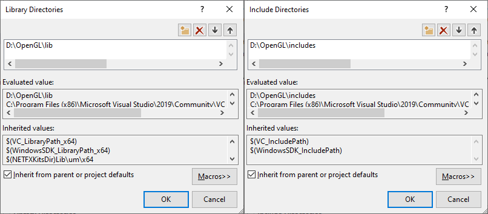

# 创建窗口

在我们使用OpenGL绘制各种炫酷的图像之前，我们需要先创建一个用于显示的窗口和OpenGL上下文（Context）来支持我们的绘制。然而，创建窗体通常和操作系统有关系，OpenGL规范是跨平台的图形API，有意识的从这些系统级API抽象出来。因此我们不得不自己创建窗体和上下文。

幸运的是，有许多的库可以满足我们创建系统窗口的需求，特别的，有些库是针对OpenGL的。这些库可以帮助我们创建一个系统窗口和一个OpenGL上下文用来渲染。通用的库有GLUT，SDL，SFML和GLFW。我们将使用GLFW作为来创建窗口。

------

### GLFW

GLFW是针对OpenGL编写的C语言库，支持创建系统窗口和OpenGL上下文，以及接收外部输入。这些功能已经基本满足了学习OpenGL的需求。

GLFW可以从[官方网站](https://www.glfw.org/download.html)上获取，提供预编译二进制文件版本和源码版本用于编译自己的二进制文件。预编译的二进制文件不总是合适每个人的电脑，因此可以选择源码版本，通过源码预定义好的CMake脚本，构建GLFW项目，通过自己的电脑环境编译出合适自己的GLFW库文件（glfw3.lib）。

### 包含和链接GLFW

得到glfw3.lib后，我们有两种方式让我们的OpenGL练习项目包含进来：

1. 将GLFW的头文件和库文件放在IDE的头文件和库文件路径下，这样IDE就能查找和引用到GLFW。但是这种方式是不推荐的，因为这种方式很难跟踪和管理第三方的头文件和库文件，一旦我们重新安装或更换了IDE，之前设置就丢失了，我们不得不重新操作一次。
2. 推荐的方式是在我们的项目工程下（或者其他任意你熟悉的路径）新建第三方库文件夹，将GLFW（或是其他未来将引用的第三方库文件）放置在第三方库文件夹内，通过配置搜索路径来确保IDE可以定位到项目引用的第三方库文件位置。如果对CMake熟悉，更好的方式是通过CMake来构建和组织OpenGL练习项目和第三方库。




如上，添加头文件路径和库文件路径。


如上，添加依赖库，告诉链接器将会链接到glfw3.lib库文件。

现在我们已经添加了**GLFW**库到我们的OpenGL练习项目中，可以使用GLFW的功能来创建窗口和OpenGL上下文。

------

### GLAD

因为OpenGL仅仅是一个标准（或者规范），具体是由显卡驱动提供商来决定是否在特定的显卡上支持该规范，而OpenGL驱动版本众多，大多数函数的位置无法在编译时确定，而需要在运行时查询。因此开发者不得不在运行时查询所需要的函数地址并且保存为函数指针以备后续使用。这个操作通常是基于系统相关的，在Windows平台下，相关代码可是是这样的。

```c++
// define the function's prototype
typeof void (*GL_GENBUFFERS) (GLsizei, GLuint*);
// find the function and assign it to a function pointer
GL_GENBUFFERS glGenBuffers = (GL_GENBUFFERS)wglGetProcAddress("glGenBuffers");
// function can now be called as normal
unsigned int buffer;
glGenBuffers(1, &buffer)
```

如上所见，查询代码是很复杂的，而且为所有需要使用的函数都执行一次查询也很麻烦。所幸的是，同样有一些库帮助我们做了这件事，**GLAD**就是最常见和最新的一个库。

**GLAD**是一个开源库可以帮助我们查询和存储OpenGL函数指针。与大多数开源库的配置方式不同，GLAD使用一个[web service](https://glad.dav1d.de/)来配置我们使用的OpenGL规范版本，并且根据该版本来加载相关的OpenGL函数。

打开**GLAD**提供的[web service](https://glad.dav1d.de/)，选择语言为C++，设置OpenGL API版本至少为3.3，设置OpenGL模式（Profile）为Core，选中Generate a loader选项，暂时可以忽略选中扩展（Extensions），然后点击Generate就可以生成我们所需的**GLAD**库文件。

**GLAD**提供一个zip档，包含两个头文件夹和一个glad.c文件。将两个头文件夹（glad和KHR）放置在第三方库文件夹下如上以上添加好搜索路径，将glad.c文件包含进我们的OpenGL练习项目中。

如上，应该可以添加**GLAD**头文件到项目中了。

```c++
#include <glad/glad.h>
```

现在，我们已经完成了准备工作，可以开始创建一个窗口和OpenGL上下文了。

------

### 创建窗口

首先，包含GLFW和GLAD的头文件到.cpp文件中：

```c++
#include <glad/glad.h>
#include <GLFW/glfw3.h>
```

注意，需要将**GLAD**头文件放置在**GLFW**头文件之前，因为**GLAD**内部包含了**OpenGL**相关的头文件，例如 **GL/gl.h**，因此需要将**GLAD**的头文件放置在任何依赖于OpenGL的库头文件之前，比如**GLFW**。

现在，可以在函数中初始化**GLFW**。

```c++
int main()
{
    glfwInit();
    glfwWindowHint(GLFW_CONTEXT_VERSION_MAJOR, 3);
    glfwWindowHint(GLFW_CONTEXT_VERSION_MINOR, 3);
    glfwWindowHint(GLFW_OPENGL_PROFILE, GLFW_OPENGL_CORE_PROFILE);
    //glfwWindowHint(GLFW_OPENGL_FORWARD_COMPAT, GL_TRUE);
    
    return 0;
}
```

首先调用了**glfwInit()**来初始化**GLFW**库，在使用大部分的**GLFW**库提供的函数前，首先都需要初始化**GLFW**。接着调用了**glfwWindowHint**来设置一些**GLFW**的参数选项，第一个参数指定了GLFW可配置选项枚举，通常以**GLFW_**前缀开始（详细的可配置选项列表：[GLFW's window handling](http://www.glfw.org/docs/latest/window.html#window_hints)）。

由于我们使用OpenGL3.3版本，因此我们指定了GLFW主版本（**GLFW_CONTEXT_VERSION_MAJOR**）和次版本号（**GLFW_CONTEXT_VERSION_MINOR**）为3.3，这样**GLFW**可以创建适配版本的**OpenGL Context**。同时指定了使用OpendGL的Core-Profile模式。如果使用MacOS，还需要打开注释的代码，这样上方设置的配置才能生效。

*注意，需要确定系统支持OpenGL3.3或者更高版本，否则会出现崩溃或者不可预知的错误。Linux可以运行glxinfo，Windows上可以使用其他工具（例如：[OpenGL Extension Viewer](http://download.cnet.com/OpenGL-Extensions-Viewer/3000-18487_4-34442.html)）。如果低于3.3，可以检查显卡是否支持OpenGL3.3，必要的话需要更新显卡驱动，甚至更换显卡。*

接下来，就可以创建一个窗口。

```c++
GLFWwindow* window = glfwCreateWindow(800, 600, "LearnOpenGL", NULL, NULL);
if(window == NULL)
{
	std::cout<<"Failed to create GLFW window." << std::endl;
	glfwTerminate();
	return -1;
}
glfwMakeContextCurrent(window);
```

调用**glfwCreateWindow**创建一个GLFW窗口，第一个和第二个参数分别指定窗口的宽高，第三个参数指定窗口的名称，最后两个参数可以忽略。函数返回一个**GLFWwindow**对象，我们可以保存此对象已被后续使用，并调用**glfwMakeContextCurrent**创建OpenGL Context。

------

### 使用GLAD

前文介绍过，GLAD可以帮我们生成OpenGL各函数的指针。因此，在调用任何OpenGL函数之前，需要先初始化GLAD，否则OpenGL函数位置时未知的。

```c++
if(!gladLoadGLLoader((GLADloadproc)glfwGetProcAddress))
{
    std::cout<<"Failed to initialize GLAD"<<std::endl;
    return -1;
}
```

我们传递给GLAD用于加载系统相关的OpenGL函数指针地址的函数，**GLFW**提供的是**glfwGetProcAddress**，它根据我们使用的系统定义正确的函数。

------

### Viewport

在开始渲染之前，还需要设置OpenGL渲染窗口的大小。

```c++
glViewport(0, 0, 800, 600);
```

前两个参数设置窗口左下角的坐标，第三个和第四个参数用于设置窗口的宽高尺寸。这里我们设置为GLFW窗口的尺寸，这样渲染窗口就是铺满的，当然也可以设置的更小，这样OpenGL就会在一个较小的尺寸下渲染。

*在幕后，OpenGL会通过**glViewport**设置的尺寸将OpenGL处理过的坐标映射到屏幕坐标上，例如本例中，OpenGL坐标（-0.5,0.5），转换到屏幕坐标就是（200,450）。注意，OpenGL标准坐标都是位于[-1,1]之间的，在本例中，[-1,1]则通过**glViewport**设置的参数映射到[800,600]上。*

用户可能会随时调整显示窗口的大小，因此需要注册一个回调函数，监听显示窗口的变化，实时调整OpenGL渲染窗口的大小。

```c++
void framebuffer_size_callback(GLFWwindow* pWindow, int width, int height);
```

如上声明了一个窗口大小变化的回调函数，函数接受GLFWwindow参数和两个int数值表示新的窗口宽高。但窗口大小发生变化时，GLFW就会调用回调函数，填充相应的参数值以便处理。

```c++
void framebuffer_size_callback(GLFWwindow* pWindow, int width, int height)
{
    glViewport(0, 0, width, height);
}
```

还需要将回调函数设置到GLFW中，GLFW就可以在调用到回调函数。

```c++
glfwSetFrameBufferSizeCallback(pWindow, framebuff_size_callback);
```

当窗口被第一次创建显示时，回调函数也会被调用，通知当前的窗口尺寸。对于视网膜（Retina）屏，回调函数返回的值会比设置的值大一些。

GLFW中还有许多其他的回调函数可供我们注册处理，比如游戏操控杆输入的变化、错误异常处理等等，我们一般在创建GLFW窗口后，在渲染循环之前注册好相应的回调函数。

------

### 准备开始渲染

我们并不希望程序只绘制一次图形图像，就马上关闭的窗口，而是持续不断的绘制图形图像并处理用户的输入，除非明确的告诉程序应该关闭了。因此我们需要创建一个while循环，被称作为**渲染循环（Render Loop）**，能够不断的运行直到通知GLFW停止。以下代码是一个非常简单的渲染循环：

```c++
while(!glfwWindowShouldClose(pWindow))
{
    glfwSwapBuffers(pWindow);
    glfwPollEvents();
}
```

**glfwWindowShouldClose**函数在while循环开始时检查窗口是否关闭，如果关闭，则结束渲染循环，结束程序。**glfwPollEvent**则是检查当前循环周期是否触发了某些事件，比如键盘输入事件或者鼠标移动事件等，如果有，则更新窗口的状态，调用预先注册的回调函数，处理这些事件。**glfwSwapBuffers**会交换渲染缓冲区（一种巨大的2D缓冲区，包含GLFW窗口每个像素的色值），它被用来在一次渲染循环周期将渲染结果输出到屏幕上。

*双缓冲（Double Buffer）机制。如果一个程序只使用一个缓冲区来渲染图像，可能会存在图像闪烁的问题。因为渲染最终输出的图像不是一瞬间完成的，通常是从左到右从上到下逐像素绘制的，因此用户会感觉不真实（伪像 artifact）。为了规避这个问题，程序可以申请两个缓冲区用来渲染，前缓冲区包含输出到屏幕上的全部像素颜色（最终图像），而新的绘制指令被输出到后缓冲区中，当全部的绘制指令绘制结束后（一个渲染循环），交互前后缓冲区，保证输出到屏幕而图像是完整的，避免伪像问题。*

结束渲染循环后，退出应用程序之前，应该清理申请了GLFW相关资源，可以main函数退出之前调用**glfwTerminate**来清理GLFW的相关资源。

```c++
glfwTerminate();
return 0;
```

------

### 处理输入

我们可以通过GLFW提供的一些输入状态函数来实现输入处理。比如可以使用GLFW提供的**glfwGetKey**函数来获取某个按键是否被按下的状态，函数接受一个Window窗体和一个按键的Key作为输入，返回这个Key的按键是否被按下。

```c++
void processInput(GLFWwindow* pWindow)
{
    if(glfwGetKey(pWindow, GLFW_KEY_ESCAPE) == GLFW_PRESS)
    {
        glfwSetWindowShouldClose(pWindow, true);
    }
}
```

如上定义了一个处理输入的函数，该函数检查Esc按键是否被按下（如果没有按下，则glfwGetKey返回GLFW_RELEASE），如果按下了，则设置**WindowShouldClose**属性设置为true，这样，下个渲染循环就会结束，然后程序退出。

在渲染循环中调用输入处理函数，如下：

```c++
while(!glfwWindowShouldClose(pWindow))
{
    processInput(pWindow);
    
    glfwSwapBuffers(pWindow);
    glfwPollEvents();
}
```

上面的代码在每帧都检查指定的按键是否被按下以便及时作出处理，一个渲染循环周期被称之为帧。

------

### 渲染指令

我们会在渲染循环中插入一些渲染指令，因为这样才能在每个渲染循环中都执行相应的渲染指令。

```c++
// Render loop
while(!glfwWindowShouldClose(pWindow))
{
    // input
    processInput(pWindow);
    
    // rendering commands her
    ...
    
    // check and call events and swap the buffer
    glfwPollEvents();
    glfwSwapBuffers(pWindow);
}
```

做些测试是否渲染指令能否正常工作，我们可以自定义一个颜色来清空屏幕，我们在每帧都执行这个操作，否则会看到屏幕颜色仍然是上一帧渲染的结果。我们可以通过调用**glClear**并传递指定的缓冲位（标记我们要清空的缓冲区）来清空屏幕颜色。常见的标记位有**GL_COLOR_BUFFER_BIT**，**GL_DEPTH_BUFFER_BIT**，**GL_STENCIL_BUFFER_BIT**。目前只要清空屏幕颜色，因此只要使用GL_COLOR_BUFFER_BIT来清空屏幕颜色缓冲。

```c++
glClearColor(0.2f, 0.3f, 0.3f, 1.0f);
glClear(GL_COLOR_BUFFER_BIT);
```

上面的代码通过调用**glClearColor**来设置要清空屏幕缓冲的颜色。当调用**glClear**来清空屏幕颜色缓冲后，会使用**glClearColor**中设置的色值来填充屏幕颜色缓冲区。

*之前介绍过OpenGL是一个巨大的状态机，有一些状态变更函数来更新当前的状态，另一些状态使用函数使用新的状态来刷新OpenGL上下文。这里就可以看出，glClearColor是状态变更函数，变更当前清空的颜色，glClear就是状态使用函数，使用当前的状态来清空颜色。*

最终应该会看到如下的一个GLFW窗口：

