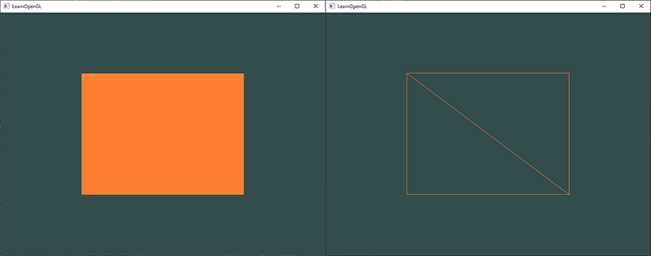

# 绘制三角形

OpenGL中，所有的物件都是三维空间中的，但是我们的屏幕或者窗口是二维的，因此OpenGL中很大一部分工作是将三维坐标装换为屏幕二维坐标。这部分在被称为**OpenGL渲染管线（Graphics pipeline of OpenGL）**的流程中处理。OpenGL渲染管线主要可以划分为两部分，第一部分将三维空间坐标转化为二维屏幕坐标，第二部分将二维屏幕坐标转为为显示设备上的像素（colored pixels）。这部分，我们将探讨OpenGL渲染管线，以及如何通过它渲染出一个三角形。

------

### OpenGL渲染管线

OpenGL渲染管线将接受一组三维空间坐标，并最终转化为二维屏幕上的像素点。可以将渲染管线划分为几个部分，每一部分将上一部分的输出作为输入处理。这些部分都是高度专业化的，并且各部分很容易被并行执行。现代显卡的设计也因为渲染管线的天然并行执行特性，而设计了成千上万的小处理核心可以快速的在渲染管线中处理数据。这些处理核心为渲染管线的各个部分运行着在GPU上执行的小程序，这些小程序被称之为**着色器（Shader）**。

渲染管线中某些步骤的Shader可以被我们所控制，我们可以编写自己的Shader来替换默认的Shader，这样我们就可以更加细粒度的控制OpenGL渲染管线中的特定步骤，而且因为Shader运行在GPU上，因此它可以节省CPU的效能。Shader可以使用**OpenGL Shading Language（GLSL）**来编写。

下图，可以看下渲染管线各个步骤的抽象图示。注意，蓝色的部分是可被我们控制的。


如上图所示，渲染管线包含的许多步骤，通过这些步骤一步步将我们输入的顶点数据转为像素点。下面我们将简要的介绍渲染管线的各个部分，这样可以对渲染管线的运行有一个初步的了解。

首先，我们将一组可以组成三角形的三维坐标以数组的形式作为输入传递给渲染管线，这些数据被称为**顶点数据（Vertex Data）**，它是一些顶点的集合。一个顶点是一个三维坐标的数据集合，这些数据被称为**顶点属性（Vertex Attribute）**，可以包含任何我们想要的数据。简单起见，先让每个顶点属性包含一个三维坐标和一些顶点颜色数据。

*为了让OpenGL知道我们传递的输入数据要渲染什么，比如要使用这些数据渲染一个三角形？渲染一个点？或者是渲染一条线？我们需要指定如何让OpenGL来组织这些输入数据，这些渲染类别被称为**图元（Primitives）**。OpenGL提供了一些图元类别，比如**GL_POINTS**，**GL_TRIANGLES**以及**GL_LINE_STRIP**，在调用任何渲染指令时，我们都需要指定图元类型。*

 渲染管线的第一个步骤是**顶点着色器（Vertex Shader）**。它将一个顶点作为输入，主要作用是将顶点的3D坐标转化为另一种坐标，同时对顶点属性做一些基础的处理。

下一个步骤是**图元装配（Primitive Assembly）**，它将所有顶点着色器输出的顶点作为输入（如果将图元指定为GL_POINT，则是一个顶点），将这些顶点装配为指定的图元形状。

图元装配阶段输出的数据将被传递到渲染管线的下一阶段中，被称为**几何着色器（Geometry Shader）**。几何着色器输入可以组成指定图元的一些列顶点，能够通过新增新的顶点来生成新的（或是其他的）图元形状。上图中，图元转配生成一个三角形被几何着色器分成两个新的三角形。

几何着色器处理结束后，结果被传递到渲染管线的下一阶段，被称为**光栅化（Rasteriaztion Stage）**。在此步骤中，几何着色器输出的最终的图元被映射到屏幕对应的像素上，生成一系列**片段（Fragment）**供下一阶段，被称为**片段着色器（Fragment Shader）**，使用。在片段着色器运行之前，**裁剪（Clipping）**被执行，所有屏幕视图范围外的片段被丢弃，以减少片段着色器处理的数据量，提升性能。

*OpenGL中的一个片段是OpenGL渲染一个像素需要的全部数据。*

**片段着色器（Fragment Shader）**的主要目的就是计算一个像素的最终颜色，这里也通常是OpenGL中各种高级效果产生的地方。通常，片段着色器中还包含3D场景中的一些数据（比如光照，阴影，光的颜色等等），以便片段着色器能够计算出最终的像素色值。

当所有的像素颜色被计算确定后，最后会被传递到渲染管线的最终阶段，被称为**Alpha测试和混合（Alpha Test And Blending）**阶段。此阶段中，将检查各个片段的深度值和模板值，并且通过这些数据确定一个片段是在其他物体的前面还是后面，以及是否应该被丢弃，同时还检查片段的Alpha值（该值定义了片段的透明度），以确定是否需要混合其他物体的颜色。因此，即使片段着色器中计算了像素的颜色，最后渲染在屏幕上的颜色也可能与片段着色器不同。

如你所见，OpenGL的渲染管线是非常复杂的，且包含了许多可配置的阶段。实际上，在大多数场合中，我们只需要处理**顶点着色器（Vertex Shader）**和**片段着色器（Fragment Shader）**的阶段，几何着色器是可选的且通常使用默认的Shader。且这里还没有介绍**曲面细分阶段（Tessellation Stage）**和**变换反馈阶段（Transform Feedback Loop）**。

在现代OpenGL中，至少要先定义一个顶点着色器和一个片段着色器（GPU中没有默认的顶点着色器和片段着色器）。因此对于初学者而言，学习OpenGL是很困难的，因为在渲染出第一个三角形之前，就需要了解大量的渲染管线知识。本节结束，当你绘制出第一个三角形后，就会对图形编程有一个大概的认识。

------

### 顶点输入

为了绘制一些东西，我们必须要提供一些顶点数据到OpenGL中。OpenGL是一个3D渲染库，因此我们必须提供3D坐标（x，y，z坐标），而且，OpenGL不会简单的将所有的顶点都传递到渲染管线中，OpenGL只处理xyz3个坐标轴上位于[-1,1]范围的顶点，位于此范围的被称为**标准化设备坐标（Normalized Device Coordinates）**范围，这个范围对应到屏幕上的各个像素。

因为我们准备绘制一个三角形，因此我们需要指定3个位于标准设备坐标系的3D坐标，如下所示，在一个float数组中定义个各个坐标位置。

```c++
float vertices[] = {
    -0.5f, -0.5f, 0.0f,
     0.5f, -0.5f, 0.0f,
     0.0f,  0.5f, 0.0f
};
```

因为OpenGL工作在3D空间，而目前只绘制2D三角形，因此给定的3个坐标，z轴都是0。这样所有顶点的**深度（Depth）**就是一样的，看起来就是2D的。

*P.S. **标准化设备坐标（Normalized Device Coordinates，简称NDC）**，一旦顶点坐标在顶点着色器中处理结束后，输出的顶点应该都在是标准设备坐标系中（xyz轴的坐标范围在[-1，1]区间内），任何在此范围外的顶点都会被丢弃或者裁剪，在屏幕空间是不可见的。下图显示了我们准备绘制的三角形和相应的**标准化设备坐标**顶点。*

**

*不像通常的屏幕坐标系，标准化设备坐标Y轴正向是向上的，且坐标原点（0，0）是在屏幕中的的，而不是左上角。最终，所有的顶点（装换后的）应该都落在这个坐标区间内，否则这些点将是不可见的。*

*标准化设备坐标会通过**视口变换（Viewport Transform）**被转换到**屏幕空间（Screen-Space Coorinates）**中，使用通过**glViewport**函数设置的视口数据。转换后生成的屏幕坐标会被组合成片段作为片段着色器的输入继续处理。*

定义完顶点数据后，我们准备将顶点数据传递到OpenGL渲染管线的第一个阶段：**顶点着色器 Vertex Shader** 中。这将会在GPU中创建内存来存储我们的顶点数据，并且配置OpenGL如何来解释这些数据以及如此将这些数据发送到显卡中进行处理。接着顶点着色器就会处理我们在内存中指定的这些顶点数据。

我们通过**顶点缓冲对象（Vertex Buffer Objects，简称VBO）**来管理内存，它可以在GPU内存（通常被称为显存）中存储大量顶点。使用这个对象的好处是我们可以一次性大量的传递顶点数据到显卡上，只要它有足够的空间可以存储，而不是一次传递一个顶点数据。因为从CPU传递数据到显卡是非常耗时的操作，所以我们应该尽可能的一次性传递更多的数据。一旦数据存储到的显卡的内存中，顶点着色器就可以非常快速（几乎是瞬时）的访问到这些数据。

顶点缓冲对象是目前碰见的第一个OpenGL对象，就像其他OpenGL对象一样，这个缓冲可以用一个唯一ID来标识，我们可以通过glGenBuffer函数来生成一个缓冲ID。

```c++
unsigned int VBO;
glGenBuffers(1, &VBO);
```

OpenGL有许多类型的缓冲对象，顶点缓冲对象的类型是**GL_ARRAY_BUFFER**。OpenGL允许我们同时绑定多个缓冲，只要它们有不同的缓冲类型。我们可以glBindBuffer函数将刚创建的缓冲绑定到**GL_ARRAY_BUFFER**目标上。

```c++
glBindBuffer(GL_ARRAY_BUFFER, VBO);
```

现在，我们调用的任何使用缓冲（在GL_ARRAY_BUFFER目标上）都会配置到当前绑定的缓冲上，即之前创建的VBO。现在我们可以使用**glBufferData**函数将之前创建的顶点数据拷贝到绑定的缓冲内存中。

```c++
glBufferData(GL_ARRAY_BUFFER, sizeof(vertices), vertices, GL_STATIC_DRAW);
```

glBufferData函数可以将用户指定的数据拷贝到当前绑定的缓冲中。第一个参数是目标缓冲类型：当前是顶点缓冲对象绑定到了GL_ARRAY_BUFFER目标上。第二个参数是要拷贝的数据的大小（字节数），我们用简单的sizeof运算符计算当前vertices的大小。第三个参数是实际需要拷贝的数据。

第四个参数是用来指定我们希望显卡如何来管理拷贝进缓冲的数据。有下列三种形式：

- **GL_STREAM_DRAW**：数据被设置一次，并且GPU最多使用几次（数据每次绘制都会改变，from LearnOpenGL CN）。
- **GL_STATIC_DRAW**：数据被设置一次，且GPU多次使用（数据不会或几乎不会改变，from LearnOpenGL CN）。
- **GL_DYNAMIC_DRAW**：数据会多次变更，且GPU多次使用（数据会被多次改变，from LearnOpenGL CN）。

三角形的位置数据不会改变，并且多次使用，每次绘制是都是一样的，因此使用GL_STATIC_DRAW是最合适的。如果摸个缓冲的数据会被平方的变更，那个使用类型应该设置为GL_DYNAMIC_DRAW，以确保显卡将这些数据缓冲在允许告诉写入的内存中。

现在，我们已经将顶点数据存储在显卡的内存中，并且使用顶点缓冲对象（VBO）来管理这个内存，接下来，就可以创建顶点着色器和片段着色器来使用这些数据进行渲染了。

------

### 顶点着色器（Vertex Shader）

顶点着色器是一种可以被编程的着色器程序。现代OpenGL中，如果要渲染任意东西，则我们必须要创建至少一个顶点着色器和片段着色器。现在，我们将配置两个非常简单的着色器用来渲染我们的三角形。在下一章节中，我们叫介绍更多的着色器知识。

第一件事是使用**OpenGL着色器语言（OpenGL Shading Language，简称GLSL）**来编写Shader，并且编译以供我们的程序使用。下面展示了一个简单的用GLSL编写的顶点着色器。

```glsl
#version 330 core
layout(location = 0) in vec3 aPos;
void main()
{
  gl_position = vec4(aPos.x, aPos.y, aPos.z, 1.0);
}
```

如你说见，GLSL语法看起来很像C语言。每个Shader的开始都是先定义版本。自从OpenGL3.3之后，GLSL的版本都和OpenGL保持匹配的（例如，GLSL版本420表示OpenGL版本4.2）。然后，我们同样显式的定义我们将使用OpenGL的核心渲染模式（Core）。

接着，我们通过***in***关键字来定义输入到Shader的顶点属性（Vertext Attribute）。目前，我们只使用了顶点的位置属性来绘制三角形，因此只需要定义一个顶点属性。GLSL的vec数据类型有1到4的后缀表示，用于表示该向量类型有几个分量。因为每个顶点都是3D坐标，因此我们使用***vec3***数据类型来保存顶点位置属性。我们同样通过***layout(location = 0)***来指明输入变量的位置，稍后将解释为什么我们需要设置设个位置。

**向量（Vector）**，*在图形编程中，向量这个数学概念是非常常见的，因为它能非常好的表示任何空间中的位置或方向，并且有使用的数学属性。GLSL中的向量最多可容纳4个分量，并且每个分量可以很容易的由vec.x，vec.y，vec.z和vec.w来获取，每个分量都代表了空间中每个轴的位置坐标。注意vec.w并用来表示空间坐标（因为我们在三维空间，而不是四维），但是这个分量在一些**透视划分（Perspective Division）**非常有用。我们将在以后的章节更加深入的学习向量。*

为了设置Vertex Shader的输出，我们将输入的位置赋值给预定义的vec4变量***gl_Position***。在顶点着色器main函数的左后，无论我们给***gl_Position***设置什么值，它都将作为顶点着色器的输出到渲染管线的下一步骤中。由于我们输入的是vec3值，而***gl_Position***的数据类型是vec4，因此我们需要将vec3转化为vec4。我们可以将xyz赋值到vec4中，将vec4.w分量设置为1来完成这个工作。

如上就是一个最简单的顶点着色器程序，它没有多顶点做任何处理，只是简单的将输入赋值到输出。在实际的渲染程序中，输入顶点坐标通常不是标准化设备坐标，因此我们首先是需要将输入的坐标转化到OpenGL的可视区间中。

------

### 编译Shader

我们将上面的Shader代码保存在一个C字符串中，如下所示：

```c++
const char* vertexShaderSource = "#version 330 core\n"
  "layout(location = 0) in vec3 aPos;\n"
  "void main()\n"
  "{\n"
  "	gl_Position = vec4(aPos.x, aPos.y, aPos,z, 1.0);\n"
  "}\0"
```

为了OpenGL能使用这个Shader，我们需要在运行期动态的编译Shader源码。所以我们首先需要创建一个Shader对象，同样的通过ID来引用。通过**glCreateShader**我们可创建一个Shader并且返回一个unsigned int的ID来保存它。

```c++
unsigned int vertexShader;
vertexShader = glCreateShader(GL_VERTEX_SHADER);
```

我们需要提供一个我们想创建的Shader类型的参数给**glCreateShader**。因为我们创建的顶点着色器，因此我们传递**GL_VERTEX_SHADER**。

接着，我们将Shader代码附加在着色器对象上，并且编译这个Shader。

```c++
glShaderSource(vertexShader, 1, &vertexShaderSource, NULL);
glCompileShader(vertextShader);
```

**glShaderSource**的第一个参数是我们要操作的着色器对象，第二个参数是要传递的Shader源码字符串数量，这里只有1个字符串，第三个参数是Shader的源码字符串，第四个参数可以先设置为NULL。

*我们或许想要知道调用**glCompileShader**后，Shader是否正确编译，是否有什么错误需要修复。可以通过如下代码检查Shader的编译期状态：*

```c++
int success;
char infoLog[512];
glGetShaderiv(vertexShader, GL_COMPILE_STATUS, &success);
```

*首先，定义一个success的整型变量标记是否成功，以及一个字符数组用于保存错误信息（如果发生错误）。然后我们可以调用**glGetShaderiv**函数获取Shader是否编译成功，如果失败，可以在通过**glGetShaderInfoLog**函数来获取错误信息。*

```c++
if(!success)
{
	glGetShaderInfoLog(vertexShader, 512, NULL, infoLog);
	std::cout<<"ERROR::SHADER::VERTEXT::COMPILATION_FAILED\n"<<infoLog<<std::endl;
}
```

------

### 片段着色器（Fragment Shader）

片段着色器是第二个也是最后一个我们为绘制三角形创建的Shader，它是负责计算输出到屏幕各位置像素的颜色的Shader。

- *计算机图形中的颜色通过一个4个元素数组描述，即红（the red）、绿（the green）、蓝（the blue）以及透明度（alpha or opacity）四个分量，通常缩写为RGBA。在OpenGL或GLSL中定义颜色，就是在各个分量上设置为区间[0.0，1.0]的值。例如我们这是红色分量为1.0，设置绿色分量为1.0，这样就得到了红绿的混合色黄色。通过RGB三个分量的不同分配，我们可以生成超过1600万种不同的颜色。*

```glsl
#version 330 core
out vec4 FragColor;
void main()
{
  FragColor = vec4(1.0f, 0.5f, 0.2f, 1.0f);
}
```

片段着色器的输出就是一个4分量向量的颜色，用来保存最终计算的屏幕颜色输出。我们可以通过***out***关键字来定义一个输出变量。

编译片段着色器和编译顶点着色器是类似的，唯一的区别是我们创建Shader的参数是GL_FRAGMENT_SHADER。

```c++
unsigned int fragmentShader;
fragmentShader = glCreateShader(GL_FRAGMENT_SHADER);
glShaderSource(fragmentShader, 1, &fragmentShaderSource, NULL);
glCompileShader(fragmentShader);
```

现在，顶点着色器和片段着色器都已经创建并编译完成了，接下来就是链接两个着色器对象为着色器程序（Shader Program），以便渲染使用。

------

### 着色器程序（Shader Program）

**着色器程序对象（Shader Program Object）**是多个着色器合并并链接的最终结果。为了使用刚刚编译完成的着色器我们需要将他们链接为着色器程序对象并且在渲染对象是启用着色器对象。启用的着色器对象将会在发起渲染指令是被使用。

当链接着色器为着色器程序时，会将每个着色器的输出链接到下个着色器的输入。这也是如果输入输出不匹配时，会得到的错误提示。

```c++
unsigned int shaderProgram;
shaderProgram = glCreateProgram();
```

**glCreateProgram**函数返回一个ID用来保存刚创建的着色器程序对象。接下来，我们需要将刚刚创建的两个着色器对象附加到着色器程序对象上，并且调用**glLinkProgram**函数来链接着色器。

```c++
glAttachShader(shaderProgram, vertexShader);
glAttachShader(shaderProgram, fragmentShader);
glLinkProgram(shaderProgram);
```

就像编译着色器一样，我们也希望能检查是否着色器链接正常，如果错误，能知道错误的信息。可以使用**glGetProgramiv**函数和**glGetProgramInfoLog**来获取相应的信息。如下所示：

```c++
glGetProgramiv(shaderProgram, GL_LINK_STATUS, &success);
if(!success)
{
	glGetProgramInfoLog(shaderProgram, 512, NULL, infoLog);
	...
}
```

最终，我们可以调用**glUseProgram**函数来启用刚创建的着色器程序对象。

```c++
glUseProgram(shaderProgram);
```

在调用glUseProgram后，所有的着色器和渲染指令都会使用这个着色器程序对象的Shader来渲染。

记着，在链接忘着色器程序对象后，可以删除之前的Shader对象，因为我们不再需要使用这些对象。

```c++
glDeleteShader(vertexShader);
glDeleteShader(fragmentShader);
```

现在，我们已经将顶点数据存放在GPU的内存中，并且指定了GPU如何在顶点着色器和片段着色器中处理这些顶点数据。然而，这些还不够，GPU还不知道如何解释内存中的顶点数据，以及如何链接顶点数据和顶点着色器中的顶点属性输入。下面，我们将告诉GPU这些。

------

### 链接顶点属性

顶点着色器允许我们以顶点属性的形式组织我们想要的任意输入，这带来了极大的灵活性。但是这也意味这我们需要手动指定输入数据的哪部分对应顶点着色器的哪个顶点数据，即必须指明OpenGL在渲染之前如何解释顶点数据。

绘制三角形的顶点数据是这样的：


- 每个坐标分量存储为32位（4字节）的浮点型变量。
- 每个位置坐标由3个分量组合而成。
- 3个值之间没有多余的空间（或其他值），即在数组中是紧密排列（Tightly Packed）的。
- 数据的第一个值即是缓冲的开始位置。

有了上面的认知，我们可以通过**glVertexAttribPointer**来告诉OpenGL如何解释顶点数据（应用到逐个顶点属性上）。

```c++
glVertexAttribPointer(0, 3, GL_FLOAT, GL_FALSE, 3 * sizeof(float), (void*)0);
glEnableVertexAttribArray(0);
```

**glVertexAttribPointer**有许多参数，下面逐一解释每个参数：

- 第一个参数指明我们想要配置哪个顶点属性。还记得我们在顶点着色器中，我们通过**layout(location = 0)**来指定Postion顶点属性的位置，那里将Position顶点属性位置设置为了0，因此我们的参数设置为0。
- 第二个参数指明了顶点属性的大小，因为顶点属性是vec3数据类型的，因此我们将该参数设置为3。
- 第三个参数指明了顶点属性每个分量的数据类型为GL_FLOAT（GLSL中，vec3的每个分量是浮点型）。
- 第四个参数指明我们是否希望参数被标准化（Normalized）。如果我们输入了整型数（如int，byte）,并且我们设置了该参数为**GL_TRUE**，那么整型数在转化为浮点数是，会被映射到0（有符号数是-1）到1之间。这个参数目前与我们无关，我们设置为**GL_FALSE**。
- 第五个参数被称为**步长（stride）**，它用来描述连续顶点属性之间的间隔。因为下个位置数据在3个float类型长度之后，因此我们可以将步长设置为这个值。注意，我们知道我们的顶点数据是紧密排列的（Tightly Packed），因此我们也可以将步长设置为0让OpenGL取消步长（只对紧密排列的顶点数据生效）。当我们有更多顶点属性是，我们继续要小心的定义每个顶点属性的间隔。
- 最后一个参数是void*类型，因此需要进行奇怪的类型转换。这个参数表示位置数据在缓冲起始位置的偏移（Offset）。因为位置数据就在数组的起始位置，因此我们设置这个参数为0。

*每个顶点属性从被顶点缓冲对象（VBO）管理的内存上获取数据，而具体从哪个顶点缓冲对象（可能有多的顶点缓冲对象）获取数据则取决于调用**glVertexAttribPointer**时哪个顶点缓冲对象被绑定在GL_ARRAY_BUFFER目标上。在调用**glVertexAttrbPointer**前，先前定义的VBO已经被绑定好了，因此顶点属性0已经链接到了顶点数据中。*

现在我们指定了OpenGL如何解析顶点数据，接着，我们可以通过调用**glEnableVertexAttribArray**来启用顶点属性（参数为顶点属性的位置值（Location））。顶点属性默认是禁用的。现在，我们准备好了需要绘制三角形的一切，我们将顶点数据存储到了顶点缓冲对象管理的显卡内存中，创建了顶点着色器和片段着色器来处理这个数据，还配置了显卡应该如何解析这些顶点数据并链接到顶点着色器的顶点属性。下面代码展示了如何用OpenGL绘制一个对象：

```c++
// 0. 拷贝顶点数据到缓冲区
glBindBuffer(GL_ARRAY_BUFFER, VBO);
glBufferData(GL_ARRAY_BUFFER, sizeof(vertices), vertices, GL_STATIC_DRAW);
// 1. 配置顶点数据解析规则，如何链接到顶点属性
glVertexAttribPointer(0, 3, GL_FLOAT, GL_FALSE, 3 * sizeof(float), (void*)0);
glEnableVertexAttribArray(0);
// 2. 渲染时使用的着色器程序
glUseProgram(shaderProgram);
// 3. 绘制指令
someOpenGLFunctionThatDrawsOurTriangle();
```

当我们绘制一个对象时，我们不得不每次都重复这个过程。或许现在看起来不多，但是设想下如果有5个顶点属性，超过100个的不同对象（这是非常常见的场景），我们必须创建适当的缓冲对象并且快速的为每个对象配置顶点属性，这是非常麻烦的过程。

------

### 顶点数组对象（Vertex Array Object）

顶点数组对象（VerTex Array Object，简称VAO）可以像顶点缓冲对象一样被绑定，并且绑定后，所有顶点属性的调用都被存储在VAO中。带来的好处就是我们只需要配置一次顶点属性指针后，之后想要渲染该对象，只需要切换到对应的VAO，使得在不同的顶点数据和顶点属性中切换非常便利，只需要绑定不同的VAO。

*P.S. OpenGL核心渲染模式要求我们使用VAO，使得它可以知道我们会顶点输入要做什么。如果没有绑定VAO，OpenGL可能会拒绝渲染任何对象。*

顶点数组对象存储以下内容：

- 调用**glEnableVertexAttribArray**和**glDisableVertexAttribArray**。
- 通过**glVertexAttribPointer**配置顶点属性。
- 通过调用**glVertexAttribPointer**管理顶点缓冲对象和顶点属性。


创建VAO和创建VBO很类似。

```c++
unsigned int VAO;
glGenVertexArrays(1, &VAO);
```

使用VAO，所有做的只是调用**glBindVertexArray**来绑定一个VAO。绑定完成后，我们需要绑定相应的VBO以及顶点属性指针，随后可以解绑这个VAO以便后续使用。当我们想要绘制一个对象是，只要在渲染指令之前绑定正确设置的VAO就可以了。

```c++
// ..:: 初始化代码（通常只要初始化一次，除非频繁的变更） ::..
// 1. 绑定VAO
glBindVertexArray(VAO);
// 2. 绑定VBO，拷贝顶点数据到VBO对象管理的内存中
glBindBuffer(GL_ARRAY_BUFFER, VBO);
glBufferData(GL_ARRAY_BUFFER, sizeof(vertices), vertices, GL_STATIC_DRAW);
// 3. 设置顶点属性指针
glVertextAttribPointer(0, 3, GL_FLOAT, GL_FALSE, 3 * sizeof(float), (void*)0);
glEnableVertexAttribArray(0);

// ..:: 中间代码(省略) ::.. 
// [...]

//..:: 绘制代码（在渲染循环中） ::..
// 4. 启用正确的Shader
glUseProgram(shaderProgram);
// 5. 绑定相应的VAO
glBindVertexArray(VAO);
// 6. 绘制指令
someOpenGLFunctionThatDrawsOurTriangle();
```

现在，一切就绪，我们创建一个顶点数组对象（VAO）来保存顶点属性配置和使用哪个VBO。当有多个对象需要绘制时，首先先生成或者配置全部的VAO，以及所需的VBO和顶点属性指针，保存VAO以备后续使用，然后当要绘制某个对象是，选择相应的VAO，绑定它，绘制，最后解绑，依次循环，直到完成全部对象的渲染。

OpenGL提供了**glDrawArrays**函数通过当前启用的Shader，预先定义的顶点属性配置和VBO管理的顶点数据（通过VAO间接绑定）来绘制图元。

```c++
glUseProgram(shaderProgram);
glBindVertexArray(VAO);
glDrawArrays(GL_TRIANGLE, 0, 3);
```

**glDrawArray**函数的第一个参数指定了OpenGL绘制的图元类型，因为我们要绘制三角形，因此传递了**GL_TRIAGNLE**。第二个参数指明我们要绘制的顶点数组起点索引，最后一个参数指定我们要绘制的顶点个数。

最后，我们可以看见如下的三角形。


------

### 索引缓冲对象（Element Buffer Objects）

在渲染顶点是，还有一个东西我们需要讨论，**索引缓冲对象（Element Buffer Objects，缩写为EBO）**。要解释EBO如何工作最好的方式就是举个例子，设想下我们现在要绘制一个矩形，通过两个三角形组合实现（OpenGL中主要处理三角形），这样我们就需要提供6个顶点。

```c++
float vertices[] = {
  // first triangle
   0.5f,  0.5f, 0.0f, // top right
   0.5f, -0.5f, 0.0f, // bottom right
  -0.5f,  0.5f, 0.0f, // top left
  // second triangle
   0.5f, -0.5f, 0.0f, // bottom right
  -0.5f, -0.5f, 0.0f, // bottom left
  -0.5f,  0.5f, 0.0f, // top left
};
```

可以看见，我们指定的两个三角形顶点有重叠的部分，指定了两次bottom right顶点和top left顶点，然而绘制矩形，应该只需要4个顶点，而我们指定了6个，并且有重复顶点。如果以后要绘制更加复杂的模型（有超过1000个的三角形），那么可以预见将会有大量的重叠顶点。一个好的解决方案就是我们只指定一组唯一的顶点，并且通过指定顺序来控制这些顶点如何组合成三角形。

幸运的是，OpenGL的**索引缓冲对象（EBO）**就是这样工作的。EBO就像顶点缓冲对象VBO一样，是一个缓冲，它用来存储索引，OpenGL通过这些索引决定绘制的哪个顶点，这被称为**索引绘制（Indexed Drawing）**。现在我们可以指定一个顶点唯一的数组和一个存储索引的数组来绘制我们的矩形。

```c++
float vertices[] = {
   0.5f,  0.5f, 0.0f, // top right
   0.5f, -0.5f, 0.0f, // bottom right
  -0.5f, -0.5f, 0.0f, // bottom left
  -0.5f,  0.5f, 0.0f, // top left
};
unsigned int indices[] = {
  0, 1, 3,		// first triangle
  1, 2, 3			// second triangle
}
```

接下来我们创建索引缓冲对象（EBO），和创建顶点缓冲对象（VBO）类似。

```c++
unsigned int EBO;
glGenBuffers(1, &EBO);
```

同样的，和顶点缓冲对象（VBO）一样，我们使用glBindBuffer来**绑定索引缓冲对象（EBO）**，只是绑定目标是**GL_ELEMENT_ARRAY_BUFFER**，然后使用**glBufferData**来拷贝索引数组到EBO管理的内存上。

```c++
glBindBuffer(GL_ELEMENT_ARRAY_BUFFER, EBO);
glBufferData(GL_ELEMENT_ARRAY_BUFFER, sizeof(indices), indices, GL_STATIC_DRAW);
```

注意，我们现在用**GL_ELEMENT_ARRAY_BUFFER**作为缓冲目标。最后要做的是就是调用**glDrawElements**从索引缓冲中索引要渲染的三角形，而不是调用**glDrawArrays**。当调用**glDrawElements**时，OpenGL将按当前绑定的索引缓冲对象中的索引顺序绘制顶点。

```c++
glBindBuffer(GL_ELEMENT_ARRAY_BUFFER, EBO);
glDrawElements(GL_TRIANGLE, 6, GL_UNSIGHED_INT, 0);
```

第一个参数指定了绘制的模式，和**glDrawArrays**一样，我们指定为**GL_TRIANGLE**。第二个参数指定我们要绘制的顶点个数，第三个参数是索引的数据类型，我们使用**GL_UNSIGNED_INT**（无符号整型）。最后一个参数允许我们指定EBO的偏移量（或者传递一个缩影数组，但这仅在没有使用索引缓冲对象时可用）。

**glDrawElements**函数通过当前绑定在**GL_ELEMENT_ARRAY_BUFFER**目标上的索引缓冲对象EBO来获取索引。因此在每次渲染对象时，我们不得不重新绑定相应的EBO，这会有点麻烦。碰巧的是，顶点数组对象也可以追踪索引缓冲对象的绑定。当VAO绑定时，最后被绑定的索引缓冲对象会被保存在VAO的索引缓冲对象上。绑定了VAO，就可以自动绑定EBO。


***P.S. 当绑定缓冲目标是GL_ELEMENT_ARRAY_BUFFER时，VAO会保存glBindBuffer的函数调用。这意味着在解绑时，VAO也会保存。因此切记在解绑VAO前，不可以解绑索引缓冲对象，否则会导致VAO中没有保存EBO配置。***

包含了EBO的渲染代码可能是这样的。

```c++
// ..:: 初始化代码，通常执行一次 ::..
// 1. 绑定VAO
glBindVertexArray(VAO);
// 2. 绑定VBO, 拷贝顶点数据
glBindBuffer(GL_ARRAY_BUFFER, VBO);
glBufferData(GL_ARRAY_BUFFER, sizeof(vertices), vertices, GL_STATIC_DRAW);
// 3. 绑定EBO，拷贝索引数据
glBindBuffer(GL_ELEMENT_ARRAY_BUFFER, EBO);
glBufferData(GL_ELEMENT_ARRAY_BUFFER, sizeof(indices), indices, GL_STATIC_DARW);
// 4. 设置顶点属性指针并启用顶点属性
glVertexAttribPointer(0, 3, GL_FLOAT, GL_FALSE, 3*sizeof(float), (void*)0);
glEnableVertexAttribArray(0);

// ..:: 中间代码（省略） ::..
// [...]

// ..:: 绘制代码（运行在渲染循环中） ::..
// 5. 启用渲染该对象使用的Shader
glUseProgram(shaderProgram);
// 6. 绑定相应的VAO
glBindVertexArray(VAO);
// 7. 按EBO的索引所需绘制顶点
glDrawElements(GL_TRIANGLE, 6, GL_UNSIGNED_INT, 0);
// 8. 绘制结束，解绑VAO
glBindVertexArray(0);
```

现在应该可以看见如下的矩形，右侧的矩形是使用**线框模式（Wireframe Mode）**绘制的矩形，通过线框模式我们可以确定矩形由两个三角形绘制而成。



*P.S. **线框模式（Wireframe Mode）**。我们可以通过调用**glPolygonMode(GL_FRONT_AND_BACK, GL_LINE)**来设置OpenGL如何来绘制图元。第一参数是指定我们想要在三角形的前景和背景都应用图元规则，第二个参数则是告诉OpenGL以线条的方式绘制图元。在调用了**glPolygonMode**之后的渲染三角形都会使用线框模式渲染，直到我们通过调用**glPolygonMode(GL_FRONT_AND_BACK, GL_FILL)**显式的恢复到默认的模式。*

