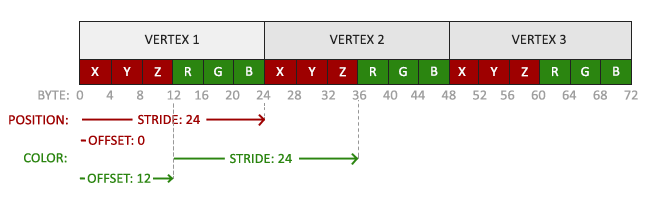
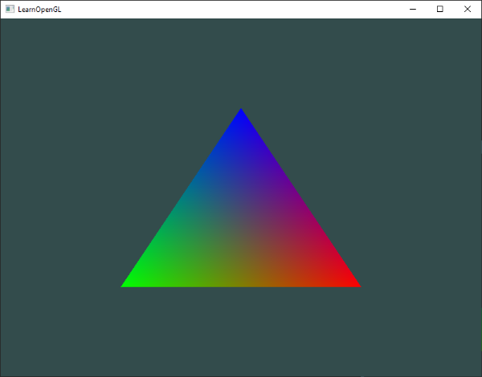

# 着色器（Shader）

上一节绘制三角形中提过，着色器（Shader）是允许在GPU上的小程序，这些程序运行在渲染管线的各个阶段中，从本质上看，着色器只不过是将输入转换为输出的程序。着色器间是非常孤立的，不能相互通信，唯一的沟通只是着色器的输入和输出。

我们在绘制三角形时学习了一些着色器的皮毛，以及如何正确的使用着色器。现在，我们将深入的了解着色器，尤其是OpenGL着色器语言（GLSL）。

------

### OpenGL着色器语言（GLSL）

Shader可以由类C语言GLSL来编写。GLSL是为图形编程量身定做的，并且针对向量和矩阵操作提供了许多实用的特性。

编写Shader总是先定义好版本，接着声明一系列的输入输出变量，uniform和main函数，main函数是Shader的入口，我们可以在这里处理任何输入变量，赋值输出到输出变量。

```glsl
#version version_number
in type in_variable_name_1;
in type in_variable_name_2;

out type out_variable_name;

uniform type uniform_name;

void main()
{
    // 处理输入变量，做一些图形处理
    // [...]
    // 赋值输出到输出变量
    out_variable_name = weired_stuff_we_processed;
}
```

需要注意的是，顶点着色器的输入变量，也被称为顶点属性（Vertex Attribute），是有数量上限的，上限一般由硬件决定。OpenGL保证有至少16个4分量的顶点属性可以使用。实际硬件可能支持更多的顶点属性，可以通过**GL_MAX_VERTEX_ATTRIBS**来查询顶点属性上限。

```c++
int nrAttributes;
glGetIntegerv(GL_MAX_VERTEX_ATTRIBS, &nrAttributes);
std::cout << "Maximum nr of vertex attributes supported：" << nrAttributes << std::endl;
```

通常情况下，返回的值应该至少是16。16个顶点属性上限通常满足大部分的需求。

------

### 数据类型（Types）

像大部分编程语言一样，GLSL也提供了一些数据类型，大部分C语言中的基本类型在GLSL中也能找到，比如int，float，double，uint和bool。GLSL还提供了两种图形编程中非常常用的容器类型，分别是向量（Vector）和矩阵（Matrix）。

GLSL中的向量可以细分包含有1,2,3,4个分量的容器，可以存放上面提到的基本类型。GLSL中的向量有以下集中形式（n代表分量的数量）：

- vecn：默认的存储float的向量。
- bvecn：存储n个bool值的向量。
- ivecn：存储n个int值的向量。
- uvecn：存储n个uint值的向量。
- dvecn：存储n个double值的向量。

可以使用**.x，.y，.z和.w**来获取向量中第1,2,3,4个分量的值。GLSL也允许使用颜色**rgba**或者使用纹理坐标**stpq**来获取相同的分量。

向量分量的访问还有一些有趣且灵活的方式，被称为**重组（Swizzling）**。如下所示：

```glsl
vec2 somVec;
vec4 differentVec = somVec.xxxx;
vec3 anotherVec = differentVec.zyw;
vec4 otherVec = someVec.xxxx + anotherVec.yxzy;
```

我们可以任意组合代表4个分量的字母（只要向量存在这个分量）来创建一个新的相同类型向量，比如我们不能使用**.z**来访问一个vec2向量。我们也可以将一个向量作为其他向量构造的参数，以减少参数的数量。

```glsl
vec2 vect = vec2(0.5, 0.7);
vec4 result = vec4(vect, 0.0, 0.0);
vec4 otherResule = vec4(result.xyz, 1.0);
```

------

### 输入和输出

Shader本身是完善的小程序，但是Shader是渲染管线整体中的一部分，因此我们有必要一些输入和输出以便能够在管线中传递数据。为此GLSL定义了关键字**in**和**out**用于声明输入和输出变量，管线中的输出变量和输入变量名称和类型匹配，上一Shader的输出变量就会被传递到输入变量上。顶点着色器和片段着色器的输入和输出变量声明会有些不一样。

顶点着色器的输入变量直接从顶点数据中获取数据，为了定义顶点数据应该如何组织数据格式，顶点着色器的输入变量需要定义一个位置（Location），以便我们能在CPU上按要求配置顶点属性。上一章节中顶点着色器中顶点属性的**layout(location = 0)**就是因为这个原因。顶点着色器需要额外的布局（layout）规范信息用来指定如何关联顶点数据。

*P.S. 顶点属性的布局声明（**layout(location = 0)**）也可以忽略，通过在OpenGL调用**glGetAttribLoaction**来查询顶点数据的位置。但是不建议这么做，因为将布局位置显示定义在顶点属性能能更直观，也更容易理解。*

还有一个例外是片段着色器需要一个**vec4**的输出变量。因为片段着色器需要生成一个最终输出颜色。如果片段着色器没有输出一个色值，那么片段着色器的颜色缓冲将会未定义（这通常意味着OpenGL会将对象渲染成黑色或者白色）。在较低的OpenGL版本中，使用GLSL**内置变量gl_FragColor**来输出。

因此如果想要在Shader间传递数据，我们需要在输出的Shader中定义一个输出变量，在接收的Shader中定义一个相同的输入变量。只要输出变量和输入变量的类型与名称一致，OpenGL就会关联两个Shader的变量使传递数据变成可能（关联输入和输出发生在链接程序对象时）。下面我们可以使用上一章节创建的两个Shader来尝试传递数据。

顶点着色器：

```glsl
#version 330 core
layout(location = 0) in vec3 aPos;// 定义输入变量顶点位置，属性位置为0
out vec4 vertexColor;// 定义一个输出变量输出顶点颜色
void main()
{
    gl_Position = vec4(aPos, 1.0);// 为内置变量gl_Position赋值
    vertexColor = vec4(0.5, 0.0, 0.0, 1.0);// 输出顶点颜色为红色
}
```

片段着色器：

```glsl
#version 330 core
out vec4 FragColor;
int vec4 vertexColor;// 输入变量接收顶点着色器传递的颜色（要求同类型同变量名）
void main()
{
    FragColor = vertexColor;
}
```

如上在顶点着色器中定义了一个vec4的输出变量vertexColor，在片段着色器同样定义了一个vec4的输入变量vertexColor，因此这两个变量会被关联，允许传递数据，因此运行应该可以看见一个红色的三角形。

现在我们能够将数据从顶点着色器传递到片段着色器。接下来，我们看看能不能直接从程序端传递数据到片段着色器。

------

### Uniforms

Uniforms是另外一种可以从CPU上的程序传递数据到GPU的Shader上的方式。与顶点属性相比，Uniform有一点不同。首先，Uniform是全局的，意味着Uniform变量在任何Shader程序对象是唯一的，管线中的任意阶段的任意Shader的可以访问到Uniform变量。其次，一旦你设置了Uniform的值，除非手动重置或者更新，否则该值会一直保持在Uniform变量上。

声明Uniform变量，我们可以使用GLSL提供的**uniform**关键字。

```glsl
#version 330 core
out vec4 FragColor;
uniform vec4 ourColor; // 声明uniform变量，在OpenGL代码中为其赋值
void main()
{
    FragColor = ourColor;
}
```

我们定义了一个vec4的Uniform变量ourColor，并且将值赋予片段着色器输出色值。因为Uniform是全局的，我们可以在管线中任意阶段的Shader中声明它，不需要通过顶点着色器中介。因为顶点着色器中没有使用这个Uniform的值，因此也没有必要在顶点着色器中声明它。

*P.S. 记着，如果声明了一个在任何GLSL代码中没有使用的Uniform变量，Shader编译时会优化掉这个无用的Uniform变量，导致最终编译版本不包含这个uniform，这可能导致一些不可预见的问题，因此需要避免声明无用的Uniform变量。*

现在这个Uniform变量的值还是空的，我们尝试给这个Uniform变量赋值。首先，我们需要在Shader找到这个Uniform变量的索引（Index）或者是位置（Location）。只要我们成功找到了这个Uniform的索引/位置，我们就可以更新Uniform的值。下面，我们升级点难度，尝试实时变更Uniform的值。

```c++
float timeValue = glfwGetTime();
float greenValue = (sin(timeValue) / 2.0f) + 0.5f;
int uniformColorLocation = glGetUniformLoaction(shaderProgarm, "ourColor");
glUseProgram(shaderProgram);
glUniform4f(uniformColorLocation, 0.0f, greenValue, 0.0f, 1.0f);
```

首先，我们通过**glfwGetTime()**获取运行时间秒数，接着，通过**sin**函数将变化区间限制在[0,1]，将最终结果存储在greenValue变量上。

接着，我们调用**glGetUniformLocation**函数来查询需要赋值的Uniform变量的位置值，我们需要提供Shader程序对象以及要查询的Uniform变量名称作为参数。如果**glGetUniformLocation**返回-1，意味着没有找到指定的Uniform属性。最后，我们使用**glUniform4f**函数来设置Uniform变量的值。注意，查询Uniform不需要启用目标的Shader Program，但是如果要设置Uniform的值，必须要启用目标Shader Program（通过调用glUseProgram），因为设置Uniform的值是在当前启用的着色器程序上。

*P.S.因为OpenGL本质上是一个C语言库，因此它原生不支持函数重载。因此当一个函数可能被不同类型参数调用时，OpenGL定义为每种类型定义一个新的函数。**glUniform**就是一个例子，这类函数有一个特定的后缀用于标识设置的Uniform类别。下面列举一些后缀和解释：*

- *f：函数接收一个float类型参数。*
- *i：函数接收一个int类型参数。*
- *ui：函数接收一个unsigned int类型参数。*
- *3f：函数接收三个float类型参数。*
- *fv：函数接收一个float类型的向量/数组参数。*

*当想要配置OpenGL的选项时，只需要选用适应类型的重载函数即可。*

现在我们知道了如何为Uniform赋值，我们可以开始使用Uniform渲染了。因为我们想要三角形的颜色实时变化，我们就需要每帧都重新这是Uniform变量值，否则只设置一次的话，三角形就只会渲染为纯色。因此，我们需要在渲染循环中实时计算色值并赋值到Uniform中。

```c++
while(!glfwWindowShouldClose(pWindow))
{
    // 处理输入事件
    processInput(pWindow);
    // 渲染
    // 清理颜色缓冲
    glClearColor(0.2f, 0.3f, 0.3f, 1.0f);
    glClear(GL_COLOR_BUFFER_BIT);
    // 启用渲染使用的Shader
    glUseProgram(shaderProgram);
    // 更新Uniform的颜色值
    float timeValue = glfwGetTime();
    float greenValue = sin(timeValue) / 2.0f + 0.5f;
    int vertexColorLocation = glGetUniformLocation(shaderProgram, "ourColor");
    glUniform4f(vertexColorLocation, 0.0f, greenValue, 0.0f, 1.0f);
    // 渲染三角形
    glBindVertexArray(0);
    glDrawArrays(GL_TRIANGLE, 0, 3);
    // 交换缓冲
    glfwSwapBuffers(pWindow);
    glfwPollEvents();
}
```

这段代码是在原先代码上简单的改造。我们在每帧更新Uniform的值，如果一切正常，将会看到三角新的颜色不断在绿色和黑色间变化。

如果需要每帧变化的值，或者直接在程序和Shader间交互数据，那么Uniform是非常便利和实用的工具。如果要为三角形每个顶点设置不同的值，那么使用Uniform就不得不声明三个Uniform变量，这种情况下，还是使用顶点属性（Vertex Attribute）更为便利。

------

### 更多的属性

上一章节，我们学会了如何将顶点数据放在VBO管理的内存中，如何配置顶点属性指针来解析顶点数据，并且将这些都通过VAO存储以便渲染时方便切换。现在，我们尝试在顶点数据中添加颜色数据，我们为每个顶点设置红绿蓝的不同颜色。

```c++
float vertices[] = {
	// position        // color
     0.5f, -0.5f, 0.0f, 1.0f, 0.0f, 0.0f, // bottom right
    -0.5f, -0.5f, 0.0f, 0.0f, 1.0f, 0.0f, // bottom left 
     0.0f,  0.5f, 0.0f, 0.0f, 0.0f, 1.0f, // top
}
```

因为我们现在需要传递更多的顶点数据到顶点着色器中，因此我们也需要调整顶点着色器，添加新的顶点属性。注意我们将新增的顶点属性aColor的布局位置设置为了1（**layout(location = 1)**）。

```glsl
#version 330 core
layout(location = 0) in vec3 aPos;	// 位置顶点属性,layout位置值为0
layout(location = 1) in vec3 aColor;// 颜色顶点属性,layout位置值为1
out vec3 ourColor;	// 输出到片段着色器的输出变量
void main()
{
    gl_Position = vec4(aPos, 1.0f);
    ourColor = aColor;	// 颜色顶点属性赋值到输出变量中
}
```

片段着色器中不需要使用Uniform变量，但是需要微调下输入变量，因为类型变成了vec3。

```glsl
#version 330 core
out vec4 FragColor;
in vec3 ourColor;	// 接收从顶点着色器中传递过来的顶点颜色属性
void main()
{
    FragColor = vec4(ourColor, 1.0);
}
```

由于添加的其他的顶点属性，我们也需要更新VBO内存空间的布局，重新配置解析该内存空间的顶点属性指针。下图描述了新的VBO内存布局：



根据上图的顶点数据布局，通过**glVertexAttribPointer**更新顶点属性解析规则。

```c++
glVertexAttribPointer(0, 3, GL_FLOAT, GL_FALSE, 6 * sizeof(float), (void*)0);
glEnableVertexAttribArray(0);

glVertexAttribPointer(1, 3, GL_FLOAT, GL_FALSE, 6 * sizeof(float), (void*)(3 * sizeof(float)));
glEnableVertexAttribArray(1);
```

前几个参数比较简单，现在我要设置的是位于布局位置1的顶点属性，顶点属性有3个float分量组成，并且不需要重新标准化这些数值。

因为现在每个顶点有两个顶点属性，为了获取正确的顶点属性，我们需要重新计算**步长（stride）**。要在顶点数据中获取下一个顶点属性（比如，获取第二个顶点的位置属性），我们需要移动6个float长度的字节包含3个float长度的位置属性和3个float长度的颜色属性，因此我们设置步长为6倍的float长度（即24字节）。同样的，我们需要设置偏移（offset），对于每个顶点，首先是位置属性然后是颜色属性，因此我们获取位置属性不需要偏移，设置为0，但是获取颜色属性，需要偏移到位置属性之后，即3个float长度（12字节）。

允许之后会看到如下的三角形：



这个三角形可能设想的不一样，我们只提供了3个顶点的颜色，呈现的效果却像是一个巨大的调色盘。这是因为片段着色器中**片段插值（Fragment Interpolation）**的结果。当渲染一个三角形时，光栅化的阶段会生成比我们指定的顶点多的多的片段。光栅化会更加这些片段在三角形的位置角色这些片段的位置，之后它就会根据这些位置对片段着色器的输入进行**插值（interpolate）**。举个例子，假设我们有一条顶部端点颜色为绿色底部端点颜色是蓝色的线段，当片段着色器运行在线段70%位置上的一个片段时，输入的颜色将会是绿色和蓝色的线性组合，确切的说，是70%的绿色和30%的蓝色组合而成的色值。**片段插值应用于片段着色器的所有输入属性**。

------

### 定义自己的Shader类

编写，编译和管理Shader是非常麻烦的。在本节的最后部分，我们将封装一个可以从硬盘读取shader代码文件，编译并且链接，检查编译和链接错误，易于使用的Shader类来减轻一些工作量。

我们在头文件中定义好类的结构：

```c++
#ifndef SHADER_H
#define SHADER_H

class Shader
{
public:
    // 读取和构建shader program
    Shader(const char* vertexPath, const char* fragmentPath);
    // 启用shader progarm
    void use();
    // 封装一些列Uniform变量设置方法
    void setBool(const std::string& name, bool value) const;
    void setInt(const std::string& name, bool value) const;
    void setFloat(const std::string& name, bool value) const;
private:
    unsigned int ID;	// 保存创建成功的shader program id
};

#endif
```

*P.S. 我们在头文件开始出使用了一些**预编译指令（Preprocessor Directive）**，使用这几行预编译指令可以确保编译器只在没有被包含的情况下编译这个文件，即使这个文件被多次引用。这可以防止链接冲突。*

这个Shader类保存着色器程序对象的引用ID。在它的构造器需要提供顶点着色器和片段着色器的文件路径，以便能够从硬盘中读入Shader代码文件并创建和链接Shader。并且提供了一些其他方法以便比较容易的适用Shader，比如**use**函数在绘制前启用这个着色器程序对象，和一些**set**方法用来设置Uniform变量的值。

我们使用C++的文件流将Shader代码文件读入带字符串中。

```c++
Shader(const char* vertexPath, const char* fragmentPath)
{
    // 1. retrieve the vertex/fragment source code from filePath
    std::string vertexCode;
    std::string fragmentCode;
    std::ifstream vShaderFile;
    std::ifstream fShaderFile;
    // ensure ifstream objects can throw exceptions:
    vShaderFile.exceptions (std::ifstream::failbit | std::ifstream::badbit);
    fShaderFile.exceptions (std::ifstream::failbit | std::ifstream::badbit);
    try 
    {
        // open files
        vShaderFile.open(vertexPath);
        fShaderFile.open(fragmentPath);
        std::stringstream vShaderStream, fShaderStream;
        // read file's buffer contents into streams
        vShaderStream << vShaderFile.rdbuf();
        fShaderStream << fShaderFile.rdbuf();		
        // close file handlers
        vShaderFile.close();
        fShaderFile.close();
        // convert stream into string
        vertexCode   = vShaderStream.str();
        fragmentCode = fShaderStream.str();		
    }
    catch(std::ifstream::failure e)
    {
        std::cout << "ERROR::SHADER::FILE_NOT_SUCCESFULLY_READ" << std::endl;
    }
    const char* vShaderCode = vertexCode.c_str();
    const char* fShaderCode = fragmentCode.c_str();
    // [...]
}
```

接下来，我们编译和链接读入的Shader。注意如果编译或链接中出现了错误，我们需要输出错误信息方便排查错误。

```c++
// 2. compile shaders
unsigned int vertex, fragment;
int success;
char infoLog[512];
   
// vertex Shader
vertex = glCreateShader(GL_VERTEX_SHADER);
glShaderSource(vertex, 1, &vShaderCode, NULL);
glCompileShader(vertex);
// print compile errors if any
glGetShaderiv(vertex, GL_COMPILE_STATUS, &success);
if(!success)
{
    glGetShaderInfoLog(vertex, 512, NULL, infoLog);
    std::cout << "ERROR::SHADER::VERTEX::COMPILATION_FAILED\n" << infoLog << std::endl;
};
  
// similiar for Fragment Shader
[...]
  
// shader Program
ID = glCreateProgram();
glAttachShader(ID, vertex);
glAttachShader(ID, fragment);
glLinkProgram(ID);
// print linking errors if any
glGetProgramiv(ID, GL_LINK_STATUS, &success);
if(!success)
{
    glGetProgramInfoLog(ID, 512, NULL, infoLog);
    std::cout << "ERROR::SHADER::PROGRAM::LINKING_FAILED\n" << infoLog << std::endl;
}
  
// delete the shaders as they're linked into our program now and no longer necessary
glDeleteShader(vertex);
glDeleteShader(fragment);
```

**use**函数就很简单了。

```c++
void use()
{
	glUseProgram(ID);
}
```

实现各个设置Uniform的函数。

```c++
void setBool(const std::string &name, bool value) const
{         
    glUniform1i(glGetUniformLocation(ID, name.c_str()), (int)value); 
}
void setInt(const std::string &name, int value) const
{ 
    glUniform1i(glGetUniformLocation(ID, name.c_str()), value); 
}
void setFloat(const std::string &name, float value) const
{ 
    glUniform1f(glGetUniformLocation(ID, name.c_str()), value); 
} 
```

现在，我们完成了Shader类的封装。现在可以使用它非常便利的创建和使用Shader对象。

```c++
Shader ourShader("path/to/shaders/shader.vs", "path/to/shaders/shader.fs");
//[...]
while(...)
{
    ourShader.use();
    ourShader.setFloat("someUniform", value);
    DrawStuff();
}
```

这里我们将顶点着色器和片段着色器保存为shader.vs和shader.fs。实际上，shader代码文件可以保存为任何你喜欢的文件名。但是后缀**.vs**和**.fs**很直观的指明了shader文件的类型。