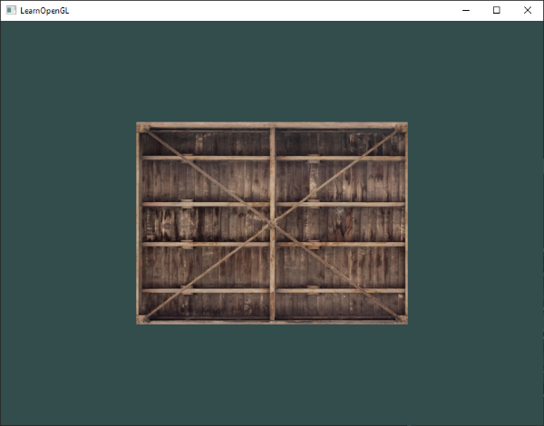
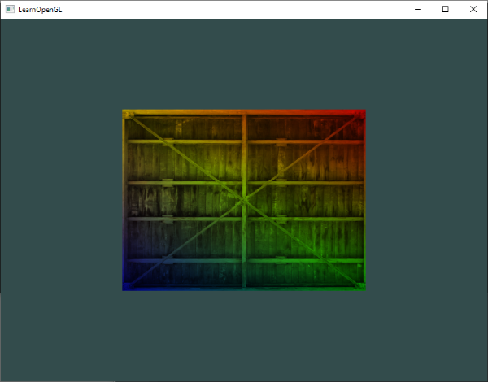

# 纹理（Texture）

我们已经知道我们可以为每个顶点添加颜色属性来增加对象的细节，来创建一些有趣的图像。但是，如果要更真实一点，我们就需要大量的顶点，这样需要指定大量的颜色。这想来就是一件工作量巨大的事，因为每个模型都有大量的顶点，而每个顶点都有颜色属性。

艺术家和程序们更喜欢使用**纹理（Texture）**。纹理是一张2D图片（甚至有1D或是3D的纹理），用来描述对象的细节。想象一下纹理是一张有着砖块图像的墙纸贴在3D的房子上，使得你的房子看起来具有石头砖块的外观。因为我们可以在图片上添加大量的细节，因此我们会觉得对象非常精细，而我们不需要添加额外的顶点。

*P.S. 不仅仅是图片，纹理也可以用来保存需要发送到Shader的大量任意数据。*

为了将纹理映射到三角形上，我们必须告诉每个三角形的顶点关联纹理的哪一部分。因此每个顶点需要有**纹理坐标（Texture Coordinate）**来指定采样纹理的哪一部分。然后使用片段插值处理其他片段。

纹理坐标在X轴和Y轴的范围都是[0,1]（2D纹理）。通过纹理坐标获取纹理的颜色被称为**采样（Sampling）**。纹理坐标的(0, 0)点表示纹理图片的左下角，(1,1)点表示纹理图片的右上角。下面的图片解释了如何映射纹理坐标到三角形上。


我们只想传递三个顶点的纹理坐标到片段着色器中，接下来会通过的插值将纹理坐标传递到每个片段着色器上。

纹理坐标会是这样的：

```c++
float texCoords[] = {
    0.0f, 0.0f,	// 左下 
    1.0f, 0.0f, // 右下
    0.5f, 1.0f,	// 顶部中点
}
```

纹理采样的解释很宽松，有很多种插值方式可以进行纹理采样插值。因此我们需要告诉OpenGL如何采样纹理。

------

### 纹理环绕方式（Texture Wrapping）

纹理坐标的范围是(0, 0)到(1, 1)，如果我们指定的坐标超出了这个范围，会发生什么？OpenGL的默认方式是重复采样这个纹理图片（我们基本上忽略浮点纹理坐标的整数部分），OpenGL还提供了其他方式：

- GL_REPEAT：纹理的默认方式，重复纹理图片。
- GL_MIRROR_REPEAT：同样重复纹理，但是每次都镜像图片。
- GL_CLAMP_TO_EDGE：将坐标限制在0到1，超出范围的坐标变限制在边缘上，因此边缘会被重复，产生边缘被拉伸的效果。
- GL_CLAMP_TO_BORDER：超出范围的坐标允许用户指定一个颜色。

当使用超出范围的纹理坐标是，每种选项都会在视觉上产生不同效果。下面图片直观展示了各个选项的不同视觉效果：


我们可以通过**glTexParameter***一系列函数在每个坐标轴上（通常为s，t轴，如果是3D纹理则还有r轴，分别类比xyz）设置前面提到的各类选项。

```c++
glTexParameteri(GL_TEXTURE_2D, GL_TEXTURE_WRAP_S, GL_MIRRORED_REPEAT);
glTexParameteri(GL_TEXTURE_2D, GL_TEXTURE_WRAP_T, GL_MIRRORED_REPEAT);
```

第一个参数是纹理目标类型，我们使用的是2D纹理，因此指定为GL_TEXTURE_2D。第二个参数是指定我们在哪个选项以及哪个轴上设置选项，我们在S轴和T轴上都设置。第三个指定了使用哪种纹理环绕方式。

如果选择指定了**GL_CLAMP_TO_BORDER**，而我们还需要指定一个边框颜色。我们可以使用glTexParamer带有fv后缀的函数来设置，我们指定选项为**GL_CLAMP_TO_BORDER**，然后传递一个float类型的数组来指定边框颜色。

```c++
float borderColor = {1.0f, 1.0f, 0.0f, 1.0f};
glTexParameterfv(GL_TEXTURE_2D, GL_CLAMP_TO_BORDER, borderColor);
```

------

### 纹理过滤（Texture Filtering）

纹理坐标不依赖于分辨率，可以是任意浮点数值，因此OpenGL需要指定如何将**纹理像素（Texture Pixel，也被称为Texel，纹素）**映射到相应的纹理坐标。尤其是当你有非常大的物体，而纹理分辨率很低的情况下就特别重要。同样的，OpenGL也有一些选项用于配置**Texture Filtering**。这里，我们目前只讨论最重要的两个选项：**GL_NEAREST**和**GL_LINEAR**。

*P.S. Texture Pixel也叫Texel。想象打开一张.jpg格式图片，不断放大会发现它是有无数像素点组成的，这个点就是纹理像素。注意不要和纹理坐标搞混，纹理坐标是设置给模型顶点的数组，OpenGL以这个纹理坐标数据去查找纹理图像上的像素，然后采样提取纹理像素的颜色。*

**GL_NEAREST(也被称为邻近(点)过滤，Nearest neighbor or point filtering)**是OpenGL默认的纹理过滤方法。当设置为GL_NEAREST时，OpenGL会选择中心最靠近纹理坐标的纹理像素。下图十字代表的纹理坐标附近有4个像素，因为左上角像素中心做接近纹理坐标，因此左上角的像素颜色会被采样。


**GL_LINEAR(也被称为线性过滤，(Bi)Linear filtering)**从纹理坐标附近的纹素计算一个插值，生成一个接近这些纹素的色值。纹理中心距离像素坐标越近，采样颜色的比重越大，下图解释了线性过滤：


两种方式在视觉上到底有什么不同？下图展示了两种方式作用在一个巨大的对象和低分辨率的纹理上的效果（纹理被放大了，每个像素都可以看清楚）。


**GL_NEAREST**模式产生更加锯齿化的输出，我们可以比较清楚的看到一个个组成纹理的像素，而**GL_LINEAR**模式产生更平滑的输出，几乎看不出独立的像素。**GL_LINEAR**产出更加真实的输出，但是一些开发者更喜欢像素风格（8-bit look），而选择使用**GL_NEAREST**。

当进行放大缩小操作时，可以设置纹理过滤的选项。比如缩小时，可以选择**GL_NEAREST**模式，而放大时，可以选择**GL_LINEAR**模式。我们同样可以通过**glTexPrameter***函数指定纹理过滤的方式。

```c++
glTexParameteri(GL_TEXTURE_2D, GL_TEXTURE_MIN_FILTER, GL_NEAREST);
glTexParameteri(GL_TEXTURE_2D, GL_TEXTURE_MAG_FILTER, GL_LINEAR);
```

------

### Mipmaps（多级渐远纹理）

想象有一个大房间，房间内有成千上万的物件，每个物件都存在纹理贴图。有一些远离观察者的物件和靠近观察者的物件有着相同的高分辨率纹理贴图。因为那些物件可能足够远，在视窗中仅仅产生几个片段（Fragment），OpenGL为这些片段计算纹理颜色时就会有些困难，因为这个纹理坐标可能映射了高分辨率纹理上的一大片区域，OpenGL不得不从这大片纹理中中计算出最终的纹理颜色。在小物件上使用高分辨率纹理也会浪费显存。

OpenGL中使用**Mipmaps**这个概念来解决这个问题。Mipmaps中包含一组纹理图片，每个纹理图片是上个纹理图片的二分之一。Mipmaps背后的理念很简单：当物件远离观察者一定距离后，使用更小分辨率的纹理来适配当前距离的物件，而因为距离足够远，低分辨率的纹理对用户来说没有明显的区别。这样，OpenGL就可以容易的采样正确的纹理颜色，同时降低了显存占用。


为每个纹理收到创建Mipmaps是非常麻烦的。幸运的是，OpenGL提供了glGenerateMipmaps函数供我们使用，它能能够在我们创建纹理后，方便的自动创建该纹理的Mipmaps。

在渲染过程中切换Mipmaps级别时，OpenGL可能会产生一些伪像，比如在两个Mipmaps级别间可见的尖锐边缘。Mipmaps层级间的过滤（Filtering）也可以向普通纹理过滤那样，使用**NEAREST**或者**LINEAR**来指定Mipmaps级别切换时的过滤方式。我们可以使用以下的Mipmaps过滤标识来代替普通的纹理过滤标识。

- GL_NEAREST_MIPMAP_NEAREST：使用邻近Mipmap来匹配纹理，使用邻近过滤采样。
- GL_LINEAR_MIPMAP_NEAREST：使用邻近Mipmap来匹配纹理，使用线性插值方式采样
- GL_NEAREST_MIPMAP_LINEAR：在最匹配的两个Mipmaps级别来进行线性插值来匹配，使用邻近过滤采样。
- GL_LINEAR_MIPMAP_LINEAR：在最匹配的两个Mipmaps级别来进行线性插值来匹配，使用线性插值方式采样。

和纹理过滤一样，我们可以使用**glTexParameteri**函数来设置Mipmaps的过滤方式。

```c++
glTexParameteri(GL_TEXTURE_2D, GL_TEXTURE_MIN_FILTER, GL_LINEAR_MIPMAP_LINEAR);
glTexParameteri(GL_TEXTURE_2D, GL_TEXTURE_MAG_FILTER, GL_LINEAR);
```

一个常见的错误是将Mipmaps过滤选项设置在纹理放大过滤上，这是没有任何效果的，因为Mipmaps主要用来适配缩小的纹理。纹理放大不会使用Mipmaps，并且如果错误的设置了Mipmaps选项，将会返回一个错误码：GL_INVALID_ENUM。

------

### 加载纹理

使用纹理的第一步是需要将纹理图片加载进来。我们可以使用一些开源的图片加载库（image-loading library），比如**stb_image.h**。

stb_image.h是非常流行的单头文件图片加载库。它可以加载大部分流行的图片文件格式，并且很容易的整合到自己的项目中。

```c++
#define STB_IMAGE_IMPLEMENTION
#include "stb_image.h"
```

通过定义**STB_IMAGE_IMPLEMENTION**宏，预编译器可以开启相关功能的代码，然后包含std_image.h头文件即可以开始使用stb_image图片加载库。

```c++
int width, height, nrChannel;
unsigned char* data = stdi_load("container.jpg", &width, &height, &nrChannel);
```

通过调用**stbi_load**函数可以加载图片，第一个参数为图片的路径，后面三个参数用于接收stbi_load函数返回的一些图片信息。第二个和第三个参数为图片的宽高，第三个参数为图片的颜色通道数。

------

### 创建纹理

现在我们可以使用stb_image加载库加载进内存的图片数据，通过OpenGL创建一个纹理。类似顶点数组对象，我们需要一个ID来指向一个Texture。

```c++
unsigned int texture;
glGenTexture(1, &texture);
```

glGenTexture接受两个参数，第一个参数为需要创建的纹理个体数，并返回这些纹理索引ID保存到第二个参数提供的数组中。接着，我们将纹理绑定到目标上，因为后续的纹理相关命令都是操作当前绑定的纹理上。

```c++
glBindTexture(GL_TEXTURE_2D, texture);
```

现在我们可以使用glTexImage2D将stbi_image加载的图片数据填充到当前绑定的纹理对象上。

```c++
glTexImage2D(GL_TEXTURE_2D, 0, GL_RGB, width, height, 0, GL_RGB, GL_UNSIGNED_BYTE, data);
glGenerateMipmap(GL_TEXTURE_2D);
```

- 第一个参数为操作的纹理目标：设置为GL_TEXTURE_2D意味着当前操作影响的是绑定在此目标上的纹理，在GL_TEXTURE_1D或者GL_TEXTURE_3D上的纹理不会影响。
- 第二个参数为我们所创建纹理的Mipmap级别，如果想要手动的设置每个纹理的Mipmap，则可以通过此参数设置，我们设置为基本级别0。
- 第三个参数指定OpenGL使用什么格式存储纹理，我们的图片只有RGB三个颜色通道信息，因此我们存储为RGB格式的纹理。
- 第四个和第五个参数用来指定纹理的宽高。
- 第六个参数总是0（历史遗留问题）。
- 第七个和第八个参数用于指定源图片数据的格式和数据类型，我们的图片是RGB格式，并且存储为unsigned char数组。
- 最后一个参数为源图片数据。

**glTexImage2D**函数调用后，图片数据就会附着到当前绑定的纹理对象上。但是，当前只有基础层级的纹理数据，如果要使用Mipmaps，我们需要手动指定所有不同层级的纹理数据（通过递增第二个参数Mipmap层级）。或者，我们也使用通过在**glTexImage2D**之后调用**glGenerateMipmap**，这样OpenGL可以自动生成当前绑定的纹理Mipmaps。

当通过OpenGL创建完纹理后，我们可以释放内存中的纹理数据了。

```c++
stb_image_free(data);
```

完整的OpenGL创建纹理代码如下：

```c++
unsigned int texture;
glGenTexture(1, &texture);
glBindTexture(GL_TEXTURE_2D, texture);
// 设置纹理环绕方式和过滤方式
glTexParameteri(GL_TEXTURE_2D, GL_TEXTURE_WRAP_S, GL_REPEAT);
glTexParameteri(GL_TEXTURE_2D, GL_TEXTURE_WRAP_T, GL_REPEAT);
glTexParameteri(GL_TEXTURE_2D, GL_TEXTURE_MIN_FILTER, GL_LINEAR);
glTexParameteri(GL_TEXTURE_2D, GL_TEXTURE_MAG_FILTER, GL_LINEAR);
// 加载并生成纹理
int width, height, nrChannels;
unsigned char* pData = stbi_load("container.jpg", &width, &height, &nrChannels, 0);
if(pData)
{
    glTexImage2D(GL_TEXTURE_2D, 0, GL_RGB, width, height, 0, GL_RGB, GL_UNSIGNED_BYTE, pData);
}
else
{
    std::cout<<"Failed to load texture"<<std::endl;
}
stbi_image_free(pData);
```

------

### 应用纹理

接下来的部分，我们将使用之前学过的使用**glDrawElement**函数绘制的矩形，将纹理绘制在这个矩形上。我们同样需要指定OpenGL如何采用纹理，因此我们需要完顶点数据中添加纹理坐标属性。

```c++
float vertices[] = {
    // position			// color		   // texture coords	
     0.5f,  0.5f, 0.0f,  1.0f, 0.0f, 0.0f,  1.0f, 1.0f,			// top right
     0.5f, -0.5f, 0.0f,  0.0f, 1.0f, 0.0f,  1.0f, 0.0f,			// bottom right
    -0.5f, -0.5f, 0.0f,  0.0f, 0.0f, 1.0f,  0.0f, 0.0f,			// bottom left
    -0.5f,  0.5f, 0.0f,  1.0f, 1.0f, 1.0f,  0.0f, 1.0f			// top left
}
```

顶点属性的组成格式如下图所示：


```c++
glVertexAttribPointer(2, 2, GL_FLOAT, GL_FALSE, 8 * sizeof(float), (void*)(6 * sizeof(float)));
glEnableAttribArray(2);
```

每个顶点数据现在有3个顶点属性，分别是顶点位置属性，顶点颜色属性和纹理坐标属性，因此我们需要调整顶点数据的步长为**8*sizeof(float)**。

接下来，我们需要调整顶点着色器，使可以接收纹理坐标顶点属性，并且将纹理坐标传递到片段着色器中。

```glsl
#version 330 core
layout (location = 0) in vec3 aPos;
layout (location = 1) in vec3 aColor;
layout (location = 2) in vec2 aTexCoord;

out vec3 vColor;
out vec2 vTexCoord;

void main()
{
  gl_position = vec3(aPos, 1.0);
  vColor = aColor;
  vTexCoord = aTexCoord;
}
```

片段着色器中会将顶点着色器中的输出变量作为输入片段接收。此外，片段着色器还需要能够访问纹理对象，以便采样对应纹理坐标的纹素数据。GLSL为纹理对象内置了数据类型，为一系列特定纹理类型后缀的**sampler**数据类型，比如**sampler1D**，**sampler3D**以及本例中使用的**sampler2D**。我们可以在片段着色器中定义一个sampler2D类型的uniform变量用来，将纹理对象数据放在这个uniform变量中。

```glsl
#version 330 core
out vec4 FragColor;

int vec3 vColor;
int vec2 vTexCoord;

uniform sampler2D uTexture;

void main()
{
  FragColor = texture(uTexture, vTexCoord);
}
```

我们可以通过GLSL的内建函数**texture**来采样纹理颜色，**texture**函数的第一个参数为纹理数据，第二个参数为纹理坐标。调用**texture**函数后，就会根据我们之前设置的纹理参数来采样相应的颜色值。片段着色器将输出相应纹理坐标（光栅化期间插值的）采样的颜色值。

接下来要就的就是将纹理数据绑定到纹理目标上，OpenGL就会自动将纹理数据对应的片段着色器的sampler类型的uniform变量中，最后调用glDrawElements，我们就可以在我们的矩形中绘制出相应的纹理。

```c++
glBindTexture(GL_TEXTURE_2D, texture);
glBindVertexArray(VAO);
glDrawElements(GL_TRIANGLES, 6, GL_UNSIGNED_INT, 0);
```

你会看到如下结果：



我们还可以尝试混合纹理颜色和顶点颜色，比如简单的将纹理颜色乘上顶点颜色，

```
FragColor = texture(uTexture, vTexCoord) * vec4(vColor, 1.0);
```

将获得的如下结果：



------

### 纹理单元

或许会奇怪为什么**sampler2D**是一个uniform变量，但是我们并没有使用**glUniform**系列函数为其赋值，却可以直接使用。其实，我们的确可以通过**glUniform1i**函数为着色器中的**纹理采样器（Texture Sampler）**赋值，该值标识纹理采样器采样的纹理的位置索引，被称之为**纹理单元（Texture Unit）**。纹理的默认纹理单元为0，默认是被启用的，因此如果我们只有一个纹理，就相前面的例子，就可以在绑定纹理带目标时（glBindTexture）指定使用的纹理单元。需要注意的是，部分显卡驱动可能不支持默认启用纹理单元，因此前面的例子有可能不能正确的渲染纹理，而需要手动指定启用的纹理单元。

使用纹理单元的主要目的是可以在同一着色器中使用多个纹理。通过为着色器中定义的采样器赋值纹理单元值，我们就可以在着色器中使用多个纹理，只要我们首先正确的启用了对应的纹理单元，在调用**glBindTexture**函数之前，我们可以通过**glActiveTexture**函数，通过传递纹理单元值为参数，启用相应的纹理单元。

```c++
glActiveTexture(GL_TEXTURE0);	// active the texture unit before binding texture
glBindTexture(GL_TEXTURE_2D, TextureId);
```

启用纹理单元后，glBindTexture函数就会将当前纹理绑定到启用的纹理单元上。**GL_TEXTURE0**通常来说是默认被启用的。

*P.S. OpenGL保证至少有16个纹理单元可以使用，相应的枚举值为**GL_TEXTURE0**到**GL_TEXTURE15**。这些纹理单元的值都是顺序的，因此比如可以使用**GL_TEXTURE0 + 8**来代替**GL_TEXTURE8**。这通常在一些循环使用纹理单元的场景特别有用。*

调整片段着色器代码使用多个纹理采样器。

```glsl
#version 330 core
...

uniform sampler2D uTexture1;
uniform sampler2D uTexture2;

void main()
{
    FragColor = mix(texture(uTexture1, vTexCoord), texture(uTexture2, vTexCoord), 0.2);
}
```

最终输出的颜色是两个纹理采样结果的混合。GLSL提供了内建函数**mix**，可以对两个颜色进行线性插值，前两个参数为从两个纹理分别采样的颜色值，第三个参数为插值比例，如果参数3值为0，这混合结果为第一个颜色参数，如果是1，则结果为第二个颜色参数，这里0.2表示返回80%的参数一颜色和20%的参数二颜色插值结果。

```c++
unsigned char* pImageData = stbi_load("awesomeface.png", &width, &height, &nrChannels, 0);
if(pImageData)
{
    glTexImage2D(GL_TEXTURE_2D, 0, GL_RGB, width, height, 0, GL_RGBA, GL_UNSIGNED_INT, pImageData);
    glGenerateMipmap(GL_TEXTURE_2D);
}
```

和前面的例子一样的方式，通过stbi_load加载第二张图片，并且使用glTexImage2D函数将纹理数据填充到显存中。需要注意的是，第二个纹理图片我们使用的是png格式，包含和alpha（透明度）通道。因此只要指明图片格式为GL_RGBA，否则OpenGL会错误解释图片数据，无法正确生成纹理数据。

因为有多个纹理，因此我们在绑定纹理到目标是需要正确的启用相应的纹理单元。

```c++
glActiveTexture(GL_TEXTURE0);
glBindTexture(GL_TEXTURE_2D, texture1);
glActiveTexture(GL_TEXTURE1);
glBindTexture(GL_TEXTURE_2D, texture2);
```

同样的，我们需要通过**glUniform1i**函数指定着色器中纹理采样器绑定的纹理单元。我们只需要指定一次即可，不需要每次渲染都重新指定。

```c++
ourShader.use(); // 在设置Uniform前需要启用目标Shader
glUniform1i(glGetUniformLoaction(ourShader.ID, "vTexture1"), 0); // set it manually
ourShader.setInt("vTexture2", 1); // or with shader class
// 渲染循环
while(...)
{
    [...]
}
```

可以看到如下结果：


可以看到渲染出来的纹理，上下翻转了。这是因为OpenGL坐标（0,0）在左下角，而通常图片坐标原点在图片的左上角。stb_image.h库可以帮我们翻转Y轴，只需要一行简单的代码。

```c++
stbi_set_flip_vertically_on_load(true);
```

之后就可以看到如下的渲染结果。


