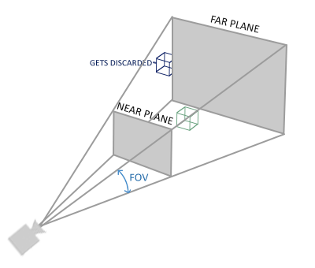

# 坐标系（Coordinate System）

OpenGL要求所有需要显示的顶点坐标都位于[-1, 1]之间**（NDC，Normalized Device Coordinate）**，在这个范围外的坐标将被忽略不可见。在实际场景中，我们更喜欢使用自定义的坐标系，在Vertex Shader中再将坐标转换到NDC中，然后再将装换后的坐标传递到光栅化阶段，最终转换为屏幕上的像素。

我们可以利用矩阵变换将坐标一步步的装换到NDC中，通常都需要经过几个中间坐标系。使用中间坐标系的好处是某些对坐标的计算/操作在当前的中间坐标系下更加容易和更有意义。有5个不同的中间坐标系对于变换过程比较重要：

- **本地空间，或称为对象空间（Local Space or Object Space）**
- **世界空间（World Space）**
- **观察空间，或称为视觉空间（View Space or Eye Space**）
- **裁剪空间（Clip Space）**
- **屏幕空间（Screen Space）**


上图诠释了各个坐标空间是如何转换的。我们使用一些转换矩阵将坐标从一个坐标空间转换到下一坐标空间，其中比较重要的几个转换矩阵是**模型（Model），观察（View），投影（Projection）**矩阵。通过这些矩阵，可以将最初处于模型空间的顶点坐标经过世界空间，观察空间，裁剪空间，最终转换到屏幕空间，显示在屏幕的正确像素上。

------

### 本地空间（Local Space）

本地空间是基于你的对象的一个坐标空间。想象一下在一个模型编辑软件中（比如Blender）创建一个立方体，立方体会有一个（0,0,0）的原点，所有你所创建的模型都有自己的（0,0,0）原点，这些立方体或者模型上的顶点都是基于自己的原点计算，这些顶点坐标就是在本地空间中，它们基于自己的立方体或模型对象。

------

### 世界空间（World Space）

假设我们的游戏世界中多个对象，每个对象都挤在同一个位置时不合适的，我们会希望各个对象都被放置在不同位置上，就像真实世界一样。这些对象在游戏世界的位置就是在世界空间中，对象的每个顶点都相对于这个世界的原点，而不是对象的原点。我们使用**模型矩阵（Model Matrix）**将顶点坐标从本地空间变换到世界空间中。

模型矩阵是一个将对象经过位移旋转缩放等操作将它放置在世界坐标的合适位置和朝向上的一个变换矩阵。它能够将对象上的顶点坐标经过变换，转换到世界空间的相应位置上。

------

### 观察空间（View Space）

在OpenGL中，观察空间通常被当做摄像机（因此观察空间也被称为摄像机空间（Camera Space）或者视觉空间（Eye Space））。观察空间是将世界空间的坐标转换到基于用户观察位置前的坐标的结果，因此观察空间是基于摄像机观察位置的一个坐标系空间。通过将世界空间下的对象进行位移和旋转来向当前对象转换到摄像机面前。这些转换信息被保存在**观察矩阵（View Matrix）**上，因此可以通过观察矩阵将坐标从世界空间变换到观察空间。

------

### 裁剪空间（Clip Space）

在Vertex Shader执行完毕后，OpenGL将所有的顶点坐标都转换一个特定的范围，任何不在该范围的坐标都将被**裁剪（Clip）**。被裁剪的坐标将被丢弃，而其余的坐标经过光栅化后转化为片段，最终显示在屏幕上。这也是裁剪空间名称的由来。

因为将所有可见的坐标都转化为[-1,1]范围并不直观，因此我们自己指定一个裁剪坐标范围，然后将该范围的坐标变换到NDC坐标下。

将顶点坐标从观察空间装换到裁剪空间，我们可以定义一个**投影矩阵（Projection Matrix）**来指定一个范围，比如-1000到1000。投影矩阵将在这个范围的坐标转换到NDC下，而在这个范围外的坐标不会被映射到-1到1的NDC坐标系，将直接被裁剪。

*P.S. 注意，如果图元（Primitive），例如三角形的一部分顶点在裁剪体积外，OpenGL将会将这个三角形重组为一个或多个三角形图元来满足裁剪范围。*

投影矩阵指定的观察箱（Viewing Box）被称为**视锥（Frustum）**，所有在视锥之内的坐标都会被映射到屏幕上，视锥之外的则被裁剪。将视锥范围内的三维坐标变换为可以容易映射到2D空间的NDC坐标系的过程被称之为**投影（Projection）**，因为投影矩阵将三维坐标变换到了容易映射二维空间的标准设备坐标（NDC）。

将所用顶点变换到裁剪空间后，最后一步被称为**透视除法（Perspective Division）**会被执行，我们会将坐标中的x、y、z分量分别除以齐次坐标的w分量。透视除法是将四维裁剪空间坐标转化为三维标准设备坐标的变换操作。透视除法在Vertex Shader运行的最后被自动执行。

透视划分之后，产生的结果坐标通过**glViewport**函数设置的视图参数映射到屏幕空间中，然后变化为一系列片段（Fragments）。

投影矩阵通常使用两种方式将观察空间的坐标变换到裁剪空间，每种方式都定义自身唯一的视锥。我们可以创建一个**正射投影矩阵（Orthographic Projection Matrix）**或者**透视投影矩阵（Perspective Projection Matrix）**。

------

### 正射投影（Orthographic Projection）

正射投影矩阵定义一个立方体形状的视锥空间作为裁剪空间，所有在这个立方体范围外的顶点被裁剪。当创建一个正射投影矩阵时，我们需要指定立方体形状视锥的长宽高。所有在视锥内的坐标经过正射投影矩阵变换后都能过映射到NDC坐标系中，否则就被裁剪。

下图为正射投影示意图：


正射投影视锥通过宽高以及一个远平面（Far plane）和近平面（Near plane）来定义可视范围。在远平面后和近平面前的任意坐标都将被裁剪。正射投影视锥直接将所用视锥内的坐标映射到NDC坐标上，因为齐次坐标的w分量在正射投影下不会有任何影响，如果w分量为1，则透视除法不会改变坐标值。

我们可以使用GLM提供的函数**glm::ortho**来创建一个正射投影矩阵：

```c++
glm::ortho(0.0f, 800.0f, 0.0f, 600.0f, 0.1f, 100.0f);
```

前两个参数指定了正射投影视锥的左右两个边界，第三和第四两个参数指定了正射投影视锥的下上两个边界，通过这四个参数，我们可以得出裁剪屏幕的尺寸，然后通过第五和第六个参数，分别指定近平面和远平面的距离位置（相对于正射投影相机）。通过正射投影矩阵，所有观察空间的xyz坐标都会被变换到标准设备坐标下。

正射投影矩阵会将坐标直接映射到2D平面上，但是在现实中，正射投影的结果是不真实的，因为没有考虑透视效果。而透视投影会带来更真实的模拟。

------

### 透视投影（Perspective Projection）

如果在欣赏一张来自真实世界的图片，你会注意到近的对象会比较大，而远的物件会比较小，这就是透视效应。**透视投影矩阵（Perspective Projection Matrix）**就是要模拟这种效果，以带来更真实的世界模拟。透视投影矩阵同样通过设定视锥来作为裁剪范围，但是同时透视投影还会通过操纵每个顶点坐标的w值来模拟透视效果，如果顶点距离观察者越远，则通过透视投影矩阵变换后，w值会越大。所有通过透视投影变换的坐标，最终都会在-w到w范围中，否则就会被裁剪。因为OpenGL的NDC坐标要求所有可视的顶点都在-1到1范围内，透视除法阶段，裁剪空间范围内的坐标（范围在-w到w），每个xyz分量分别除以w分量，能够落在-1到1的范围内。最终Vertex Shader输出的顶点坐标：
$$
out = 
\left(
\begin{matrix}
x / w \\
y / w \\
z / w \\
\end{matrix}
\right)
$$
经过透视除法后，距离观察者越远的坐标，就会越小（越远，w越大，得出的out越小）。这也是为什么齐次坐标的w分量非常重要的一个原因，因为它能帮助我们非常容易的实现透视投影。

我们可以使用GLM提供的函数**glm::perspective**来构建透视投影矩阵：

```c++
glm::perspective(glm::radians(45.0f), (float)width/(float)height, 0.1f, 100.0f);
```

glm::perspective通过一些参数构建一个视锥来定义裁剪范围，透视投影视锥如下所示：



第一个参数为FOV角，它代表视野（Field Of View）的广度。模拟一个更真实的效果的话，通常设置为45度，当然不同风格可以设置不同的FOV值。第二个参数设置平面的宽高比，该宽高比是通过视口的宽度除以高度来计算的。第三和第四个参数则是设置视锥的近平面和远平面的距离（相对于相机）。

*P.S. 如果把近平面设置的太远，比如（10.0），那么OpenGL会将0到10.0的所用顶点都裁剪掉，这就会产生在视频游戏用非常常见的一个问题，当距离一个对象太近的时候，视线会穿过了模型的表面。*

*P.S. [如何计算一个正射投影矩阵或是透视投影矩阵的链接](http://www.songho.ca/opengl/gl_projectionmatrix.html)*

透视投影包含透视效果，而正射投影不包含透视效果，即没有近大远小的效果，因此正射投影更适合进行2D渲染，或是一些我们不希望被透视形变影响的渲染场景。比如一些用于3D模型编辑的软件（Blender）有时使用正射投影相机来编辑模型，因为它更能准确的描绘每个对象的尺寸。

------

### 组合所有的变换

现在我们介绍了从本地空间变换到裁剪空间的所有步骤，并创建了相应的变换矩阵，一个顶点从本地空间变换到裁剪空间可以用以下公式描述：
$$
V_{clip} = M_{projection} \cdot M_{view} \cdot M_{model} \cdot V_{local}
$$
记住矩阵的乘法是反向的，即向量总是先乘以最右的矩阵。计算的结果在Vertex Shader中被赋值给GLSL的内建变量**gl_Position**，然后OpenGL自动的进行透视除法，将裁剪空间的坐标变换为NDC范围内，裁剪掉不在NDC范围内的坐标，将输出的NDC格式坐标通过glViewport设置的视口参数，映射到屏幕空间上，每个坐标都关联屏幕上的点（这个过程被称之为**视口变换（Viewport Transform）**）。

------

### 左手坐标系和右手坐标系

OpenGL使用的是右手坐标系，这意味着X轴正向指向观察者右边，Y轴正向指向观察者向上，而Z轴正向指向观察者的背后，如下图所示。


右手坐标系：

- 举起右手，向上，指向Y轴正向。
- 伸出拇指，指向X轴正向。
- 伸出食指，指向Y轴正向。
- 弯曲中指90度，则中指指向Z轴正向。

如果使用左手按上述步骤操作，则会发现中指的指向是相反的，这时称之为左手坐标系，在DirectX中使用的就是左手坐标系。注意，**OpenGL的标准化设备坐标系（NDC）实际上使用的也是左手坐标系（投影矩阵转换了手性）**。

------

### Z缓冲（Z-Buffer）

OpenGL将所有的深度信息存储在被称之为**Z缓冲（Z-Buffer，也被称为深度缓冲，Depth Buffer）**的缓冲区内。OpenGL可以根据Z-Buffer的信息决定一个像素是否要重新绘制。我们可以使用Z-Buffer来配置OpenGL执行**深度测试（Depth-Testing）**。

GLFW会自动为我们创建Z缓冲区，就像也会创建颜色缓冲区（存储输出到屏幕的像素颜色）一样，每个输出的Fragment的深度（根据Fragment的Z值计算）都会存储在这里。当Fragment要输出最终颜色时，OpenGL会根据Z-Buffer中存储的深度数据，决定是否要输出该颜色，如果当前Fragment的深度比其他Fragment要低则忽略，否则则重写颜色为当前Fragment输出的颜色，这个过程被称为**深度测试（Depth-Testing）**。

OpenGL能够自动执行Depth-Testing，但是需要我们启用Depth-Testing，默认是不启用的。我们可以使用**glEnable**或是**glDisable**函数来启用或是禁用OpenGL的一些功能，启用或禁用OpenGL的某些功能后，将会持续功能状态到重新禁用或启用相应功能。Depth-Testing也是这样，我们可以通过**GL_DEPTH_TEST**来启用OpenGL的Depth-Testing。

```c++
glEnable(GL_DEPTH_TEST);
```

同样，和颜色缓冲区一样，每次渲染前，我们需要清理Z-Buffer的数据，否则上一次渲染产生的深度数据会残留在缓冲区中。我们同样可以使用**glClear**来清理Z-Buffer，通过指定Z-Buffer的标记位 **GL_DEPTH_BUFFER_BIT**。

```c++
glClear(GL_COLOR_BUFFER_BIT | GL_DEPTH_BUFFER_BIT);
```

