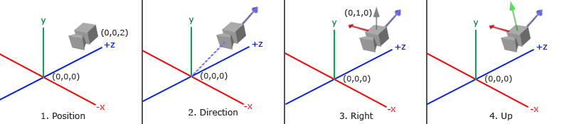

# 摄像机（Camera）

我们在之前的章节讨论了观察矩阵（View Matrix），以及如何使用观察矩阵来变换世界场景。在OpenGL中，并没有类似摄像机的概念，因此我们通过反向移动旋转整个世界场景来模拟摄像机的视角变换。现在，我们将创建一个摄像机。

------

### 摄像机/观察空间

摄像机/观察空间，其实就是以摄像机角度作为场景原点下的各个顶点坐标，观察矩阵可以将世界空间坐标转换到关于摄像机的位置和方向的观察空间坐标。因此，要定义一个摄像机，就必须要知道摄像机在世界空间中的位置，观察的方向，一个指向观察方向向右的向量和一个指向观察方向向上的向量，本质上，就是构建一个以摄像机位置为坐标原点，三个相互垂直的单位向量构成的坐标系。



假设我们将摄像机的位置（CameraPos）放置在世界空间的（0，1，3）点，将世界空间场景原点作为摄像机观察方向指向的点（CameraTarget），则（CameraTarget - CameraPos）即可得到摄像机的观察方向。对于观察矩阵的坐标系，我们希望其Z轴为正向，而按照惯例（OpenGL中），摄像机观察方向是世界坐标系Z轴负方向，因此我们会将前面观察方向取反，作为摄像机坐标系的z轴正向，即（CameraPos - CameraTarget）。**用观察方向来描述观察空间坐标系的Z轴正向不太准确，其实他是观察方向的负方向。**

```c++
glm::vec3 cameraPos = glm::vec3(0.0f, 1.0f, 3.0f);
glm::vec3 cameraTarget = glm::vec3(0.0f, 0.0f, 0.0f);
glm::vec3 direction = glm::normalize(cameraPos - cameraTarget);
```

接下来我们需要一个右向量（Right Vector）来代表观察空间坐标系的X轴正向。我们先借用世界空间坐标系的Y轴单位向量，这样可与已知的观察空间Z轴向量构成YZ平面，然后根据向量叉积的定义，可以计算出垂直于YZ平面的法向量，即为观察空间坐标轴的X轴方向。

```c++
glm::vec3 up = glm::vec3(0, 1, 0);
glm::vec3 cameraRight = glm::normalize(glm::cross(up, direction));
```

有了X轴方向和Z轴方向，同样根据叉积定义，计算出向上的向量来表示观察空间坐标系Y轴正向。

```c++
glm::vec3 cameraUp = glm::normalize(glm::cross(direction, cameraRight));
```

P.S. 需要注意向量叉积的顺序。向量的叉积计算结果，应该会有两个方向（指向相反的方向）。我们可以根据向量叉积的顺序来判断结果的方向，如AxB，可将向量A与向量B头尾相接，如下图所示：


在左手坐标系中，如果向量A与向量B头尾相接是顺时针，则叉积结果为屏幕向外，如果是逆时针则叉积结果屏幕向内。右手坐标系则相反。GLM是基于右手坐标系的，我们要计算X轴正向和Y轴正向，就要确保两个向量顺序是正确的，否则计算结果将是X轴和Y轴负向。

现在我们有了摄像机的位置和观察控制的三个相互垂直的坐标轴，我们就可以构建LookAt矩阵，这样，就能通过矩阵的乘法计算，将任意坐标系装换到观察空间坐标系统。LookAt矩阵计算方法如下：
$$
LookAt = 
\left[
\begin{matrix}
R_{x} & R_{y} & R_{z} & 0 \\
U_{x} & U_{y} & U_{z} & 0 \\
D_{x} & D_{y} & D_{z} & 0 \\
0 & 0 & 0 & 1 \\
\end{matrix}
\right]
\cdot
\left[
\begin{matrix}
1 & 0 & 0 & -P_{x} \\
0 & 1 & 0 & -P_{y} \\
0 & 0 & 1 & -P_{z} \\
0 & 0 & 0 & 1 \\
\end{matrix}
\right]
$$
R代表RightVector，U代表UpVector，D代表DirectionVector，P代表CameraPosition。注意，左侧旋转矩阵是转置的（？），右侧位移矩阵是取反的，是因为我们希望世界场景沿着摄像机相反的方向运动。

GLM中提供了glm::lookAt函数供我们创建LookAt矩阵，函数可以接受摄像机位置、观察位置以及世界空间的UpVector三个参数来创建LookAt矩阵。

```c++
glm::mat4 view = glm::lookAt(
  glm::vec3(0, 1, 3),			// 摄像机位置
	glm::vec3(0, 0, 0),			// 相机观察位置
	glm::vec3(0, 1, 0)			// 世界空间Y轴正向
);
```

------

### 欧拉角（Eular Angles）

欧拉角由数学家欧拉提出来的，可以通过三个角度值来代表3D空间的任意旋转。这三个角度值分别被称为**俯仰角（pitch）**，**偏航角（yaw）**以及**滚转角（roll）**。下图通过飞机模型诠释了三个角的含义：


- 第一张图解释了俯仰角，表示飞机模型上下看的幅度。
- 第二张图解释了偏航角，表示飞机模型左右看的幅度。
- 第三张图解释了滚转角，表示飞机模型机体倾斜的幅度。

通过欧拉角的定义，我们就可以计算出一个三维向量表示摄像机的观察方向。


首先沿着XZ平面，垂直看向Y轴。相机观察方向为单位向量，根据俯仰角定义，可以计算出观察方向的Y值为sin(pitch)，观察方向在XZ平面的投影为cos(pitch)。


再沿着Y轴垂直看向XZ平面，则可以得到观察方向X值为cos(pitch)cos(yaw)，Z值为cos(pitch)sin(yaw)。注意这里的斜边应该是观察方向在XZ平面的投影，因此为cos(pitch)。

```c++
direction.x = cos(glm::radians(pitch)) * cos(glm::radians(yaw));
direction.y = sin(glm::radians(pitch));
direction.z = cos(glm::radians(pitch)) * sin(glm::radians(yaw));
```

因此，如果用欧拉角来定义我们之前的摄像机，因为摄像机的观察方向是Z轴负方向，因此我们需要设置偏航角（yaw）为-90，否则，如果三个角度都是0，摄像机的观察方向将会是X轴正向。

