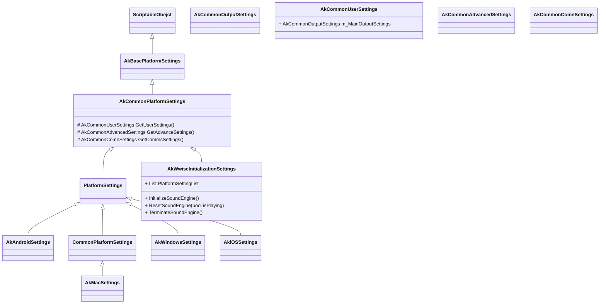

# Wwise Integration FrameWork

### Wwise原生Unity插件源码结构解析

AkWwiseInitializationSettings是Wwise原生Unity插件提供的Wwise音频引擎初始化配置，项目集成Wwise原生插件后，可在ProjectSettings -> Wwise Initialization选项卡中设置。

配置保存为一个ScriptableObject的序列化文件（.asset），保存在Assets/Wwise/ScriptableObjects路径下。

初始化Wwise音频引擎时，需要使用AkWwiseInitializationSettings配置的各项参数。相关配置内容如下：

- AkCommonUserSettings：常规的Wwise配置，如SoundBank的BasePath，初始语言，采样速度等等
- AkCommonAdvancedSettings：高级Wwise配置，如内存池大小，IO内存等等
- AkCommonComnSettings：Wwise通信相关配置，用于开发期连接Wwise进行Profier。
- 其他一些Android/iOs/Mac/Windows平台相关性的配置。如平台底层音频库等等。

AkWwiseInitializationSettings的相关的类层次结构：

AkSoundEngineController为Wwise原生插件提供的Wwise引擎状态管理器，提供初始化Wwise引擎，暂停/恢复Wwise引擎，重置引擎状态以及终止Wwise引擎操作，并提供LateUpdate，是Wwise引擎在初始化后，开始正常Tick工作。

注意点：重新编译脚本代码，Wwise音频的初始化状态不会发生变更。
