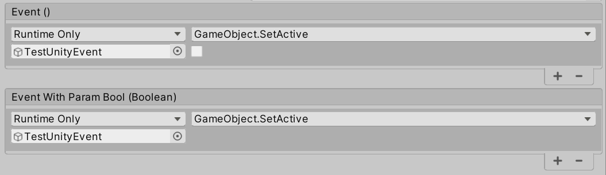

# Unity脚本

Unity脚本为开发者自定义的代码文件，继承MonoBehaviour的脚本。可以通过AddComponent方式挂载在GameObject上。

### Script执行的生命周期

MonoBehaviour脚本中定义了多个Event回调，脚本执行中，会按顺序触发相对应的回调函数，开发者可以在Event回调中处理各样的游戏逻辑。脚本执行流程中，各个回调的顺序如下所示：

脚本执行流程说明：

Awake/OnEnable事件在Scene开始是调用，Scene上的GameObject分别调用，实测各GameObject间Awake/OnEnable顺序是不确定的，GameObject的Active必须设置为true，才会调用Awake（Awake生命期只会执行一次），Component必须Enable，才会调用OnEnble。

Start事件在第一次FrameUpdate前调用，生命期中只会执行一次。必须GameObject的Active为True，脚本Component的Enable为True，才会执行Start事件。

FixedUpdate/Update/LateUpdate是处理可以大部分游戏更新逻辑的事件。FixedUpdate是基于可靠的计时器调用，每次调用间隔一致，与帧率无关，帧率较低则会一帧内多次调用，帧率较高则会多帧间调用一次。在FixedUpdate之后，物理计算和更新会立即被执行。Update每帧调用一次，可以通过Time.deltaTime获取每次Update间的间隔。LateUpdate在全部的Update执行完成后调用，每帧调用一次。（LateUpdate的一个常见应用场景是追踪玩家的摄像机移动，玩家位置可能在Update中被更新，而场景上各GameObject的Event执行顺序是不确定的，不论同级还是子级，因此追踪玩家的摄像机更新应该在LateUpdate中处理，避免处理完后，玩家位置有发生变化）。Animation更新在Update和LateUpdate之间。

OnDisable/OnDestroy，在一帧的最后被调用。挂载在GameObject上的某个Component被Disable时，这个Componenet上的OnDisable，或是GameObject的Active设置为false，这个GameObject上，包括子GameObject上挂载的所有Component，OnDisable会被调用。当GameObject被销毁时，OnDisable/OnDestroy会被先后调用，总体上会将一个GameObject以及所有的子GameObject都调用后，再调用到其他同层级的GameObject，但是子级与父级GameObject的Event顺序仍不可确定。

Tip：**代码执行应该永远不依赖与GameObject脚本的执行顺序，而应该依赖于确定的不同Event的执行顺序。**

------

### UnityEvents

UnityEvents定义在命名空间**UnityEngine.Events**中。可以在Unity脚本中添加UnityEvents的public成员，Inspector窗口中将会出现UnityEvents成员的可配置项，我们可以指定Event生效的时机，选择一个GameObject作为事件的接收者，并选择该GameObject上（以及添加的Component上）的方法作为事件回调处理的方法。

回调可以传递参数，有静态（Static）和动态（Dynamic）两种方式传递。静态方式为在Inspector中配置各个参数，动态方式为使用带泛型参数的**UnityEvents<T0[,T1,T2,T3]>**，然后在代码中使用Invoke方法，传递所需要的参数（Unity最多支持4个泛型参数）。

------

