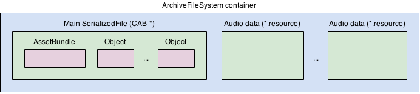

# Unity资产管理

资产（Asset）是指可以在Unity项目中使用的任意资源，这些资源可能是来源于DCC（Digital Content Creation）软件产出，比如3D模型，音频文件，纹理贴图等。可以在Unity中创建一些资产类型，比如Mesh，Animation Controller，Audio Mixer，Render Texture等。

------

### Unity如何导入资产

Unity会自动导入资产并管理一些关于这些资产的额外数据。导入过程如下：

1. Unity为资产分配一个唯一ID，这是Unity内部使用的资产引用ID，因此Unity可以移动或重命名资产而不会破坏引用结构。
2. Unity为资产创建一个.meta后缀的文件。Unity会自动为每个资产以及Assets文件夹内的子文件夹创建.meta后缀的文件。.meta文件保存着关联的资产的Unique ID，因此要求.meta文件和关联的资产在相同的位置下（如果在Unity的Project窗口操作资产文件，则Unity会自动的更新关联的.meta文件，如果在Unity外移动或重命名资产文件，则要手动保证.meta文件进行相同的移动和重命名）。
3. Unity处理资产。Unity会读取和处理Assets目录中的任意资产文件，将它转换为游戏可运行的资产文件，Assets中的资产源文件不会有任何改变，Unity将转换后的文件保存在项目Library目录中。Library文件夹可以理解为Unity使用的缓存文件夹，保存着Unity编辑器使用的资产文件。只要有Assets文件夹和ProjectSettings文件夹，Unity可以重新生成Library文件夹，因此不必将Library文件夹加入版本管理中。

.meta文件还保存着一些资产的导入设置，可以在Project窗口中选中一个资产，并在Inspector窗口中查看并编辑导入设置，新的导入设置也会保存在.meta文件中，Unitry会根据新的导入设置更新Library中的可运行资产。

------

### Asset Package

Unity支持将项目中的一部分资产文件或是数据打包，将其压缩并存储在后缀名为.unitypackage的文件中，称为Asset Package。Asset Package会保留项目原始的目录结果以及meta文件（以便重新使用时导入和保持资产间的依赖关系）。使用Asset Package可以方便的重复使用这些资产。我们可以从Unity Asset Store上查找和购买所需的第三方Asset Package，使用Package Manger导入和更新。或是使用Assets->Import Package导入自定义的Asset Package。

------

### The Asset Database

大多数的资产，Unity都需要将其转化为运行时可使用的格式，Unity将这些转化后的文件以及关联的数据保存在Asset Database中。Asset Database可以追踪每个资产的所有依赖项，并且保存每个资产的一个导入缓存版本。当资产源文件发生变更，包括源文件本身变更或是依赖项变更，Unity都会重新导入变更影响的所有资产，并更新缓存。

资产的导入缓存版本由于总是由Unity重新导入生成，因此不适合加入到版本控制中管理。但是如果在一个团队中工作，资产源文件变更，则团队中所有的Unity副本都会重新导入一次，这样会比较耗时。Unity提供了一个解决方案为**Unity Accelerator**，使用**Unity Accelerator**可以在局域网中共享资产缓存。

Unity在Library文件夹中保存两个数据库文件，这两个数据库文件一起被称为Asset Database。这两个数据库文件一个被用于追踪资产源文件（**The Source Asset Database**），一个被用于追踪导入的缓存版本（**The Artifact Database**）。

The Source Asset Database记录了资产源文件的元信息，包含了最后更新日期，文件内容的Hash，GUID（资产唯一ID）等一些元数据，可以用于当资产源文件发生变更时，Unity可以重新导入这些资产。**The Source Asset Database位于Library/SourceAssetDB**。

Artifact是Unity导入流程产生的结果，The Artifact Database包含这些结果产生的信息。每个Artifact包含了资产的依赖关系，Artifact元信息等。**The Artifact Database位于Library/ArtifactDB**。

The Asset Database还提供了一系列的API供使用者能够在代码中访问资产，控制和自定义导入流程：

```c#
// Import an Asset
AssetDatabase.ImportAsset("Asset源文件路径", ImportAssetOptions.Default); 

// Load an Asset
AssetDatabase.LoadAssetAtPath("Asset源文件路径", typeof(Texture2D)); 
AssetDatabase.LoadMainAssetAtPath([参数列表...]);
AssetDatabase.LoadAllAssetRepresentationsAtPath([参数列表...]);
AssetDatabase.LoadAllAssetsAtPath([参数列表...]);

// File Operations
AssetDatabase.CreateAsset([参数列表...]); // 创建资产
AssetDatabase.Contains([参数列表...]); // 检测是否包含目标资产
AssetDatabase.CreateFolder([[参数列表...]]); // 创建文件夹
AssetDatabase.RenameAsset([参数列表...]); // 重命名资产
AssetDatabase.CopyAsset([参数列表...]); // 拷贝资产
AssetDatabase.MoveAsset([参数列表...]); // 移动资产
AssetDatabase.MoveAssetToTrash([参数列表...]); // 资产移入回收站
AssetDatabase.DeleteAsset([参数列表...]); // 删除资产

AssetDatabase.Refresh(); // 资产变更后，立即刷新资产数据库状态
```

The Asset Database有不同的版本区别，Unity2019.3之后的版本，默认是Version 2，之前的版本默认是Version 1。可以在**Edit->Project Settings**中变更Asset Database的版本。

Unity刷新Asset Database的步骤：

1. 查找所有变更的资产文件，在The Source Asset Database中更新相应的资源。Unity会扫描Assets文件夹和Package文件夹，检查自从上次扫描发生的添加、删除、修改，生成变更列表，重新计算这些文件的Hash，更新Asset Database中对应GUID的记录，并删除已删除的资源文件记录。Unity还会追踪变更资产的依赖项，如果资产的任意依赖项发生的变更，Unity都会重新导入该资产。Asset Database追踪两种依赖关系，***静态依赖***和***动态依赖***。***静态依赖***是指导入器依赖的值、属性和设定，静态依赖在导入前就已知，且不会被导入过程中导入器的行为影响，常见的静态依赖包括资产名称、资产关联的导入器ID、导入器版本、当前选择的构建平台等。***动态依赖***是指Unity在导入过程中发现的依赖关系，这种依赖关系是定义在资产源文件的内容（content__）中，比如Shader文件中可能引用了其他Shader，Prefab文件可能依赖其他Prefab。
2. 导入并编译代码关联的文件，比如.dll，.asmdef，.asmref，.rsp和.cs后缀文件。Unity会先从变更列表中收集代码关联文件，发送到编译管线，生成项目的程序集。
3. 如果不是从脚本中调用Refresh，则会重载域。Unity检测到脚本发生变更，会重新加载C#域（C# domain），因为新的脚本可能创建了新的导入器，可能会影响到资产的导入。这个步骤会重启Refresh()以确保新的加载器生效。
4. 后处理导入的代码关联文件资产。
5. 导入并后处理非代码关联文件资产。各个资产导入器处理对应类型的资产（根据资产文件后缀名决定导入器）。有两类导入器，***源生导入器（Native Importers）***和***脚本导入器（Scripted Importers）***。*源生导入器*由Unity内建，*脚本导入器*由用户自己通过脚本创建。当导入一个资产文件时，AssetImportContext对象被创建，用来报告资产的静态依赖关系。当然，在导入过程中，会有许多的回调，比如各类资产的预处理阶段、后处理阶段，资产全部导入完毕的回调等等。
6. Unity编辑器热加载新的资产，不需要重启编辑器，就能响应新资产变更。

Asset Database还可以在代码中支持批量处理资产的变更。例如：

```c#
AssetDatabase.CopyAsset("Assets/Asset1.txt", "Assets/Text/Asset1.txt");
AssetDatabase.MoveAsset("Assets/Asset2.txt", "Assets/Text/Asset2.txt");
AssetDatabase.DeleteAsset("Assets/Asset3.txt");
```

上面代码进行和复制、移动、删除上个资产变更，Asset Database默认是按顺序处理每个资产变更，只有当前资产的刷新流程完成后，才会执行下面一行代码，这会浪费大量的时间在刷新资产上。

可以使用批量操作来避免多次的资产刷新行为，Unity提供了**AssetDatabase.StartAssetEditing**和**AssetDatabase.StopAssetEditing**来标记资产变更行为的开始和结束，在这两个函数中间，可以任意加入资产变更的代码，Unity将会在AssetDatabase.StopAssetEditing后，进行资产刷新操作，批量一次刷新之间的所有资产变更。注意，如果嵌套的调用**AssetDatabase.StartAssetEditing**和**AssetDatabase.StopAssetEditing**，必须保证能够成对匹配，其内部实现机制是一个计数器，而不是简单的开关，不能成对匹配会导致最终的计数结果不为0，而Asset Database在计数器为0时才会恢复正常的资产刷新，而且不要是的计数器小于0，这会产生一个Error错误。

```c#
using UnityEditor;
public class StartStopAssetEditingExample : MonoBehaviour
{
    [MenuItem("APIExamples/StartStopAssetEditing")]
    static void CallAssetDatabaseAPIsBetweenStartStopAssetEditing()
    {
        try
        {
            //Place the Asset Database in a state where
            //importing is suspended for most APIs
            AssetDatabase.StartAssetEditing();
            AssetDatabase.CopyAsset("Assets/Asset1.txt", "Assets/Text/Asset1.txt");
            AssetDatabase.MoveAsset("Assets/Asset2.txt", "Assets/Text/Asset2.txt");
            AssetDatabase.DeleteAsset("Assets/Asset3.txt");
        }
        finally
        {
            //Adding a call to StopAssetEditing inside
            //a "finally" block ensures that the AssetDatabase
            //state will be reset when leaving this function
            AssetDatabase.StopAssetEditing();
        }
    }
}
```

上面是推荐的使用批量刷新的方式。如果没有正确的调用到AssetDatabase.StopAssetEditing，Unity会进入一个错误的状态，对任何资产的刷新操作（增删改等等）都没有反应，除非重启Unity编辑器，才能重置为正常的状态。因此，有必要使用**try....finally**将批量过程包裹起来，这样如果资产操作过程有任何的错误，都能够正常的调用到AssetDatabase.StopAssetEditing。

------

### AssetBundle

AssetBundle是一个包含平台相关的非代码资产（比如Model、Texture、Prefab、Audio Clip等等，甚至整个场景）的归档文件，Unity可以在运行时加载。AssetBundles还可以描述相互间的依赖关系，比如一个AssetBundle中的Material可以引用到另一个AssetBundle的Texture。还可以压缩AssetBundle以便于在网络中高效的传递（热更新资源，DLC发布）。

AssetBundle可以指两个不同但关联的东西。一是硬盘上的真实文件，称为AssetBundle Archive，AssetBundle Archive是一个容器，可以包含其他文件在内，这些文件包含两种类型：

- 序列化文件，包括可以分解为独立对象的资产，写入到该单文件中。
- 资源文件，某些资产（如Texture，Audio Clip等）的二进制数据文件，Unity可以在其他线程中从硬盘加载。

另外，AssetBundle也可以指代码中创建的AssetBundle Object，可以加载硬盘中AssetBundle Archive，包含了加载进内存的AssetBundle Archive中所有资产的路径映射。

*P.S. AssetBundle Manager是旧版本的Unity用来简化管理和使用AssetBundle的工具，在2018.2版本后，应该使用Addressable Assets来替代AssetBundle Manager。*

资产归档AssetBundle的一些策略：

- 按逻辑实体归档（Logic Entity Grouping），比如同一角色的模型和动作，相同UI的纹理和布局等等。
- 按资产类别归档（Type Grouping），比如多平台通用的音频文件或者本地化文件，可以归档为单一的AssetBundle。
- 并行内容归档（Concurrent Content Grouping），指一些会被同时加载和使用的资产归档在同一个AssetBundle中。比如不同关卡中有一些关卡使用的唯一的角色、纹理、音乐等。

其他一些Tips：

- AssetBundle中一些经常变更的资产最好和不经常变更的资产分离开。
- 对可能同时加载的资产归档，比如一个模型，以及关联的贴图，动作等。
- 多个AssetBundle中的多个Asset依赖于另一个完全不同的AssetBundle的一个Asset，那么可以将依赖关系分离出来，单独组成一个AssetBundle。如果一些AssetBundle依赖于另一些AssetBundle中的相同一组Asset，那么可以将这些依赖分离为一个公用的AssetBundle，以减少资源重复。
- 如果两组Asset不可能同时加载进来，比如标准和高清Asset，那么他们需要有自己的AssetBundle。
- 如果经常加载和使用一个AssetBundle中少于50%的资源，那么可以考虑将这些资源拆分。
- 如果一些AssetBundle中Asset较少（少于5 - 10个资产），但需要经常加载使用，那么可以考虑将这些AssetBundle合并。
- 如果一组资产对象为同一对象的不同版本，那么考虑使用AssetBundle的变量（Variants）。

可以通过Unity提供的**BuildPipeline.BuildAssetBundles**方法构建AssetBundle。

```c#
BuildPipeline.BuildAssetBundles("outPath", BuildAssetBundleOptions.None, BuildTarget.StandaloneWindows);
```

**BuildAssetBundleOptions**可以通过组合来搭配不同的构建选项，其中，有三种选项处理AssetBundle的压缩策略：

- **BuildAssetBundleOptions.None**：这个选项默认使用**LZMA**格式压缩。LZMA格式需要在使用包内资源时首先解压缩整包。LZMA可以构建尽可能小的文件大小的AssetBundle包，但是更长的加载时间，因为需要整包解压。一旦AssetBundle解压后，会在磁盘上重新以LZ4格式重新压缩，这个压缩格式的好处是使用包内资源时，不再需要整包解压。仅在需要从远程服务器下载AssetBundle时推荐使用LZMA格式压缩，因为这可以尽可能的减少网络传输的数据量。通过**UnityWebRequestAssetBundle**下载的AssetBundle将会自动的重新以LZ4格式压缩并保存到本地文件系统中，而以其他方式下载和保存的，可以调用**AssetBundle.RecompressAssetBundleAsync**来重新压缩。
- **BuildAssetBundleOptions.UncompressedAssetBundle**：这个选项构建的AssetBundle将完全不压缩。这会导致比较大的包体大小，但是加载时间更短。
- **BuildAssetBundleOptions.ChunkBasedCompression**：这个选项构建的AssetBundle以**LZ4**格式压缩，包体会比LZMA格式的要大，但是更短的加载时间，因为不需要整包解压缩。LZ4使用基于块（Chunk）的压缩算法，在使用包内资产时，可以只解压对应资产所在的块，而其他未使用的块则不需要解压。

还可以使用**BuildTarget**来告诉Unity我们为哪个目标平台构建AssetBundle。如果不想通过硬编码（hardcode）方式来指定构建平台，可以使用EditorUserBuildSettings.activeBuildTarget，这样可以自动检测当前构建使用的平台，以此平台来构建相应的AssetBundle。

调用**BuildPipeline.BuildAssetBundles**构建AssetBundle后，可以在输出目录下看到构建完成的AssetBundle。可以看到生成的文件数为2(n+1)（n为Unity中指定的AssetBundle数量，不包括.mete文件），每个在Unity中指定的AssetBundle多有一个对应名称的文件和.manifest后缀的文件。此外，还有一个输出目录所在名称的AssetBundle文件和对应的.manifest文件。

AssetBundle文件的内部结构：



一个序列化文件和若干的资源文件。